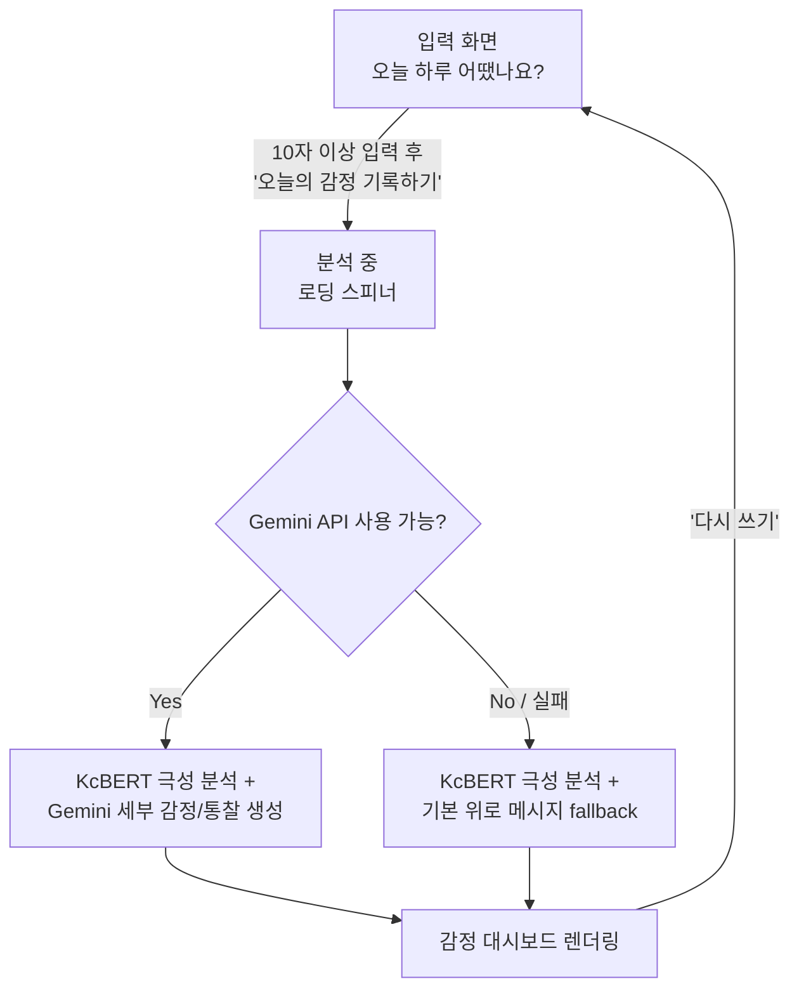
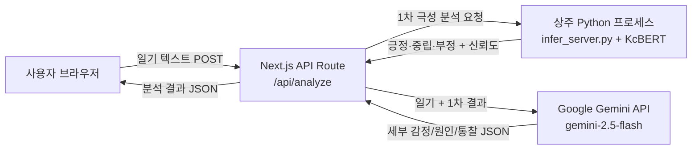

# 오늘의 하루

하루를 자유롭게 기록하면 AI가 감정을 분석하여 오늘의 감정을 따뜻한 대시보드 형태로 시각화해주는 감성 일기 웹 애플리케이션입니다.

로컬 KcBERT 모델이 감정의 극성(긍정·중립·부정)을 1차로 분류하고, Gemini가 이를 바탕으로 33가지 세부 감정을 분석하여 감정 원인, 핵심 키워드, 심리 통찰, 추천 활동 등을 함께 제공합니다.

---

## 기획 배경 및 목적

* 감정 일기는 자기 성찰과 정서 관리에 효과적인 방법으로 알려져 있지만, 매일 감정을 스스로 언어화하고 분류하는 일은 진입장벽이 있다.
* 사용자는 있었던 일을 편하게 적기만 하면, AI가 글 속에 담긴 감정의 종류와 원인, 강도를 분석하여 사용자가 자신의 감정을 쉽게 이해할 수 있는 경험을 제공하고자 기획했다.
* 단순히 "긍정/부정" 두 단어로 뭉뚱그리지 않고, 33가지 세부 감정과 원인·심리 상태·성장 포인트까지 짚어주어 하루를 더 깊이 들여다볼 수 있게 한다.
* 로컬 분류 모델(KcBERT)과 생성형 AI(Gemini)를 단계적으로 결합해, 인터넷 연결이 없는 환경에서도 기본적인 감정 분석이 가능하도록 하면서 온라인에서는 더 섬세한 분석을 제공하는 이중 구조를 설계했다.

### 타겟 사용자

* 하루를 짧게라도 기록하고 싶지만, 형식이나 분량 부담 때문에 일기를 잘 쓰지 못하는 사람
* 자신의 감정 패턴이나 원인을 객관적으로 들여다보고 싶은 사람
* 감정을 표현하는 데 서툴러서, AI의 분석을 통해 자신의 감정을 객관적으로 이해하고 싶은 사람
* 감정 일기 서비스를 포트폴리오/사이드 프로젝트로 살펴보고 싶은 개발자·기획자

---

## ✨ 프로젝트 특징

* KcBERT와 Gemini를 결합한 2단계 감정 분석 파이프라인
* 로컬 AI와 생성형 AI를 결합한 Hybrid AI 구조
* Gemini 장애 시 자동 Fallback 지원
* Apple Activity Ring 스타일의 감정 시각화
* Warm Minimal Design System 적용
* 공책 감성의 줄노트 UI

---

## 주요 기능

### 감정 일기 작성

* 하루 동안 있었던 일을 자유롭게 기록 (10자 이상)
* 실제 공책처럼 줄노트 배경과 빨간 여백선이 있는 입력창
* Gaegu 손글씨 폰트로 직접 쓴 듯한 느낌

### AI 감정 분석

* KcBERT 기반 1차 극성 분석(긍정·중립·부정), 로컬 모델로 오프라인 추론
* Gemini가 일기 내용을 바탕으로 33가지 세부 감정(행복, 설렘, 죄책감, 무기력 등) 중 최대 5개를 강도순으로 생성
* 감정 원인과 비중, 상황 키워드, 심리 상태 통찰, 성장 포인트, 내일의 나에게 보내는 응원, 감정에 맞는 추천 활동 4가지, 오늘의 응원 문장까지 한 번에 생성
* AI 한 줄 분석과 AI 코멘트를 분리해, 요약 카드에는 핵심 한 문장을, 코멘트 카드에는 2~3문장의 따뜻한 답변을 표시
* `GEMINI_API_KEY`가 없거나 Gemini 호출이 실패할 경우 KcBERT의 극성 결과와 기본 위로 메시지·추천 활동으로 자동 대체(fallback)

### 오늘의 감정 대시보드

* Apple Activity Ring 스타일의 원형 진행률로 오늘의 대표 감정과 신뢰도 표시
* 감정 요약 카드에 감정 강도(5점 척도), AI 한 줄 분석, 오늘의 키워드를 함께 정리
* 감정 분포 TOP3, 감정 원인 도넛 차트, 최근 7일 감정 변화 라인 차트로 데이터 시각화
* AI가 추천하는 활동, 오늘의 문장, 감정 분석 상세(심리 상태·주요 원인·성장 포인트·내일의 나에게) 카드 제공

> ⚠️ 감정 기록을 저장하는 데이터베이스가 아직 없어, 새로고침하거나 '다시 쓰기'를 누르면 결과가 사라집니다. 최근 7일 감정 변화 그래프와 EmotionRingCard의 '어제보다 +N%' 배지는 히스토리 저장 기능이 붙기 전까지 오늘(일요일 자리) 외에는 샘플 값을 사용합니다.

---

## 화면 흐름



* 단일 페이지 애플리케이션(SPA) 구조로, 입력 → 분석 → 결과 표시가 한 화면 안에서 전환된다.
* 별도의 로그인·회원가입 없이 바로 사용할 수 있다.
* 분석 결과와 일기 원문은 서버나 브라우저에 저장되지 않으며, 새로고침하거나 '다시 쓰기'를 누르면 초기화된다.

---

## 기술 스택

| 분야 | 기술 |
| -- | -- |
| Frontend | Next.js 16 (App Router), React 19, TypeScript |
| Styling | Tailwind CSS v4, lucide-react |
| AI | KcBERT-base (PyTorch, Transformers), Google Gemini API (`@google/genai`, `gemini-2.5-flash`) |
| Design | Pretendard, Gaegu, Warm Minimal Design System |

### 💡 핵심 기술 — Hybrid AI Pipeline

```text
KcBERT (로컬 극성 분류)
   ↓
긍정 · 중립 · 부정
   ↓
Gemini (생성형 세부 분석)
   ↓
33가지 세부 감정 + 원인 · 통찰 · 추천 활동
   ↓
감정 대시보드
```

### 시스템 아키텍처



---

## 실행 방법

### 1. 의존성 설치

#### FrontEnd

```bash
npm install
```

#### Python (AI 모델)

```bash
pip install torch transformers
```

> `BE/model/` 폴더에 KcBERT 모델(`model.safetensors`, 약 400MB)이 Git LFS로 포함되어 있어 별도 다운로드가 필요하지 않습니다. 단, 저장소를 클론하기 전에 [Git LFS](https://git-lfs.com)가 설치되어 있어야 모델 파일이 정상적으로 받아집니다(`git lfs install` 후 clone, 또는 클론 후 `git lfs pull`).
>
> `app/lib/inferServer.ts`가 `python` 명령으로 `BE/infer_server.py`를 실행하므로, PATH에서 `python`이 위 의존성이 설치된 인터프리터를 가리켜야 합니다.

---

### 2. 환경 변수 설정

프로젝트 루트에 `.env.local` 파일을 생성합니다.

```env
GEMINI_API_KEY=your_gemini_api_key_here
```

> ⚠️ 실제 API 키를 입력하고, `.env.local` 파일은 GitHub에 업로드하지 마세요.

Gemini API 키가 없어도 감정 분석 기능은 정상 동작하며,
세부 감정 대신 KcBERT의 긍정·중립·부정 결과와 기본 위로 메시지가 제공됩니다.

### 3. 개발 서버 실행

```bash
npm run dev
```

개발 서버 실행 후 아래 주소로 접속합니다.

```text
http://localhost:3000
```

> 서버가 시작되면 `instrumentation.ts`가 Python 추론 프로세스(`BE/infer_server.py`)를 미리 백그라운드에서 예열합니다. 첫 요청 전에 모델 로딩(수십 초~수 분)이 끝나지 않았다면 첫 일기 분석 요청이 다소 오래 걸릴 수 있습니다. 이후 요청부터는 상주 프로세스가 재사용되어 수 초 내로 응답하며, 프로세스가 죽더라도 다음 요청 시 자동으로 다시 기동됩니다.

---

## 🤖 AI 코딩 에이전트 안내

이 저장소는 [`AGENTS.md`](./AGENTS.md)에 Next.js 버전 관련 주의사항을 명시해두었고, [`CLAUDE.md`](./CLAUDE.md)가 이를 그대로 참조합니다.

* 이 프로젝트가 사용하는 Next.js 버전은 학습 데이터 시점의 Next.js와 API·컨벤션·파일 구조가 다를 수 있습니다(breaking changes).
* Claude Code 등 AI 코딩 에이전트로 코드를 작성하기 전에는 `node_modules/next/dist/docs/`의 관련 가이드를 먼저 확인하고, deprecation 경고를 반드시 따르세요.

---

## 📁 프로젝트 구조

```text
emotional-diary/
├── app/
│   ├── api/
│   │   └── analyze/
│   │       └── route.ts          # 감정 분석 API (KcBERT + Gemini)
│   │
│   ├── components/
│   │   ├── DiaryForm.tsx         # 일기 입력 폼 및 대시보드 레이아웃
│   │   ├── EmotionRingCard.tsx   # 오늘의 감정 원형 진행률 카드
│   │   ├── EmotionSummaryCard.tsx# 감정 요약(퍼센트/신뢰도/강도/키워드) 카드
│   │   ├── EmotionTop3Card.tsx   # 감정 분포 TOP3 카드
│   │   ├── CauseDonutChart.tsx   # 감정 원인 분석 도넛 차트
│   │   ├── WeeklyTrendChart.tsx  # 최근 7일 감정 변화 라인 차트
│   │   ├── DiaryEntry.tsx        # 작성한 일기 원문 카드 (줄노트 배경)
│   │   ├── AiMemo.tsx            # AI 코멘트 카드
│   │   ├── ActivitiesCard.tsx    # AI 추천 활동 카드
│   │   ├── QuoteCard.tsx         # 오늘의 문장 카드
│   │   ├── EmotionDetailSummary.tsx # 감정 분석 상세(심리 상태/주요 원인/성장 포인트/내일의 나에게)
│   │   └── EmotionChart.tsx      # 전체 감정 분포 막대 차트
│   │
│   ├── lib/
│   │   ├── emotion-theme.ts      # 33가지 감정 → 색상/아이콘/기분 점수 매핑
│   │   └── inferServer.ts        # 상주 Python 프로세스 관리 (spawn/큐/재기동)
│   │
│   ├── globals.css               # Warm Minimal 디자인 토큰 및 유틸리티 클래스
│   ├── layout.tsx
│   └── page.tsx
│
├── instrumentation.ts            # 서버 부팅 시 Python 추론 프로세스 예열
│
└── BE/
    ├── infer_server.py           # 상주 추론 서버 (stdin/stdout JSON 프로토콜)
    ├── infer.py                  # 단발성 CLI 추론 스크립트
    ├── predict.py                # 대화형 테스트 스크립트
    └── model/                    # KcBERT fine-tuned 3-class 모델 (Git LFS)
```

---

## 🧩 컴포넌트 설명

| 컴포넌트 | 설명 |
| -- | -- |
| DiaryForm | 일기 입력 폼과 대시보드 전체 레이아웃 구성 |
| EmotionRingCard | 오늘의 대표 감정을 원형 진행률(Apple Activity Ring 스타일)로 표시 |
| EmotionSummaryCard | 감정 퍼센트, 신뢰도 바, 감정 강도(5점 척도), AI 한 줄 분석, 오늘의 키워드를 한 카드에 정리 |
| EmotionTop3Card | 감정 분포 상위 3개를 바 형태로 표시 |
| CauseDonutChart | 감정 원인과 비중을 도넛 차트로 표시 |
| WeeklyTrendChart | 최근 7일간 감정 변화를 이모지 포인트 라인 차트로 표시 (오늘 외 요일은 샘플 값) |
| DiaryEntry | 작성한 일기 원문을 줄노트 배경 위에 손글씨 폰트로 표시 |
| AiMemo | AI 코멘트(2~3문장)를 줄노트 배경 카드로 표시 |
| ActivitiesCard | 오늘의 감정에 맞는 AI 추천 활동 4가지를 아이콘과 함께 표시 |
| QuoteCard | 오늘 하루를 위한 응원 문장을 좋아요 버튼과 함께 표시 |
| EmotionDetailSummary | 심리 상태·주요 원인·성장 포인트·내일의 나에게를 4개 카드로 표시 |
| EmotionChart | 감지된 전체 감정을 강도순으로 시각화하는 막대 차트 |

---

## 😊 감정 분류

KcBERT가 먼저 3가지 극성을 분류하면, Gemini가 이를 참고해 아래 33가지 세부 감정 중 최대 5개를 강도순으로 생성합니다.

| 극성 | 세부 감정 |
| -- | -------- |
| 긍정 | 행복, 사랑, 설렘, 감사, 안도, 자부심, 경외감, 평화로움, 흥분, 만족, 안심, 편안함, 기대, 감동 |
| 부정 | 슬픔, 분노, 불안, 혐오, 죄책감, 수치심, 질투, 외로움, 무기력, 후회 |
| 중립 | 놀람, 지루함, 피곤함, 혼란, 당황, 긴장 |

Gemini API를 사용할 수 없는 경우 KcBERT의 긍정·중립·부정 결과가 그대로 사용됩니다.

---

## 🎨 감정 색상·아이콘 체계

33가지 감정 각각이 고유한 색상과 표정 이모지를 가집니다. 큰 틀에서는 아래 색 계열을 따르되, 같은 계열 안에서도 감정마다 톤이 미세하게 다릅니다.

| 극성 | 색상 범위 | 예시 |
| -- | -------- | ---- |
| 긍정 | 황토 ~ 골드 | 행복 😄, 사랑 🥰, 설렘 🤩, 기대 🤗 |
| 부정 | 슬레이트 ~ 인디고 | 슬픔 😢, 분노 😡, 죄책감 😓, 외로움 🥺 |
| 중립 | 세이지 ~ 그레이 | 놀람 😲, 혼란 😵‍💫, 긴장 😬 |

이 색상·이모지는 감정 진행률 링, 차트, 배지 등 대시보드 전반에서 일관되게 사용되며, `WeeklyTrendChart`는 감정별 기분 점수(effect 기반)로 최근 7일 변화 그래프의 오늘 포인트 위치를 계산합니다.

---

## 🎨 디자인 시스템

**Warm Minimal Design System** — Apple HIG, Material 3, Notion, Muji 톤을 참고해 만든 카드 기반 UI 체계입니다.

### 컬러 토큰 (`globals.css`)

| 토큰 | 값 | 용도 |
| -- | -- | -- |
| `--bg` | `#F8F4EE` | 페이지 배경 |
| `--card` | `#FFFFFF` | 카드 배경 |
| `--primary` | `#8B74D9` | 포인트 컬러(보라) |
| `--secondary` | `#F5F2FF` | 태그·강조 배경 |
| `--border` | `#E8E3DA` | 카드 테두리 |
| `--text` / `--sub-text` | `#2B2B2B` / `#6D6D6D` | 본문 / 보조 텍스트 |

### 공통 유틸리티 클래스

* `.ds-card` / `.ds-card-hover` — 흰 배경, 1px 보더, radius 20px, 옅은 그림자, hover 시 `translateY(-2px)`
* `.ds-tag` — pill 형태 키워드 태그
* `.ds-progress-track` / `.ds-progress-fill` — 둥근 진행 바
* `.fade-up` — 페이지 로드 시 섹션이 아래에서 위로 살짝 떠오르는 애니메이션
* `.notepad-lines` — 줄노트 배경(가로 룰선). 입력창, 오늘의 기록, AI 코멘트, 오늘의 문장 카드에서 손글씨/코멘트가 실제 공책 위에 쓰인 듯한 느낌을 준다

### 📖 노트 컨셉

실제 종이 노트에 일기를 작성하는 경험을 살리기 위해 다음 요소를 적용했습니다.

* 입력창과 오늘의 기록 카드에 왼쪽 빨간 여백선(입력창) 또는 줄노트 배경(`notepad-lines`) 적용
* 일기 원문은 Gaegu 손글씨 폰트로 표시해, 쓸 때와 결과에서 보여질 때가 자연스럽게 이어지도록 구성
* AI 코멘트·오늘의 문장 카드도 같은 줄노트 배경을 공유해 전체 카드가 하나의 노트북처럼 읽히도록 함

---

## 🚧 알려진 제한사항

* 작성한 일기와 분석 결과는 저장되지 않습니다. 현재는 데이터베이스와 Local Storage를 사용하지 않아, 새로고침하거나 '다시 쓰기'를 누르면 사라지는 단일 세션 경험입니다.
* `WeeklyTrendChart`의 월~토 요일과 `EmotionRingCard`의 '어제보다 +N%' 배지는 히스토리 저장 기능이 도입되기 전까지 고정된 샘플 값이며, 오늘(일요일 자리)만 실제 분석 결과를 반영합니다.

---

## ⭐ 프로젝트 포인트

* 로컬 AI 모델(KcBERT)을 직접 서빙하는 상주 Python 추론 서버 구축
* Next.js API Route와 Python 프로세스 간 stdin/stdout 기반 통신 설계
* Gemini Structured JSON Output을 활용한 안정적인 응답 파싱
* Gemini 장애 시 자동 Fallback으로 서비스 연속성 확보
* Ring · Donut · Line · 막대 차트를 조합한 감정 데이터 시각화 UI 구현

---

## 향후 계획

- [ ] 히스토리 저장 기능 (데이터베이스 연동)
- [ ] 사용자 로그인 및 계정별 기록 관리
- [ ] 감정 캘린더 뷰
- [ ] 감정 통계 · 월간 리포트
- [ ] 모델 성능 개선
- [ ] 배포 환경 구성

---

## 기대 효과

* 감정을 스스로 분류하거나 언어화해야 하는 부담 없이, 사용자는 글만 작성하면 감정 인사이트를 얻을 수 있다
* 원인·심리 상태·성장 포인트까지 함께 제시되어, 단순 기록을 넘어 자기 이해를 돕는 도구로 기능한다
* 로컬 모델(KcBERT)과 생성형 AI(Gemini)를 결합한 2단계 파이프라인과 Fallback 설계를 통해, 외부 API 장애 상황에서도 서비스의 안정성과 연속성을 확보하는 구조를 검증할 수 있다

---

## 📌 라이선스

본 프로젝트는 개인 학습과 포트폴리오를 목적으로 제작되었습니다.
상업적 이용을 목적으로 하지 않습니다.
