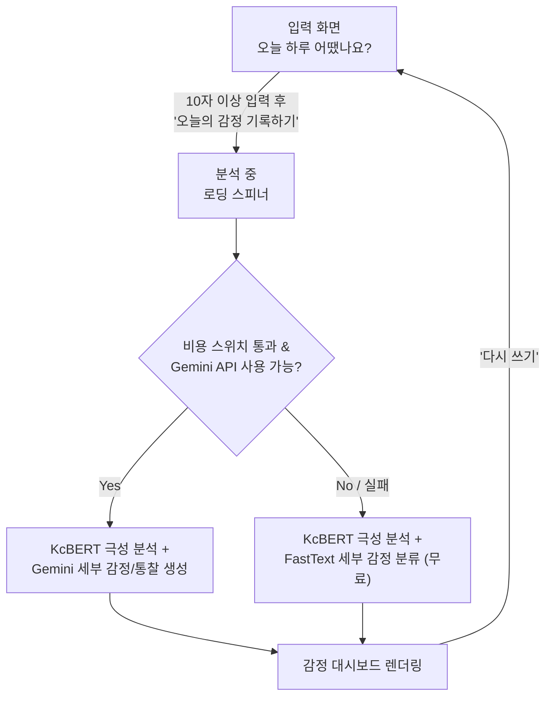

# 오늘의 하루

하루를 자유롭게 기록하면 AI가 감정을 분석해 따뜻한 대시보드 형태로 보여주는 감정 일기 웹 애플리케이션입니다.

프론트엔드(Next.js)와 백엔드(FastAPI)가 분리된 구조로, KcBERT(극성 분류) → Gemini(생성형 세부 감정 분석) 또는 FastText(무료 CPU 다중 라벨 분류) 3단계 파이프라인을 갖고 있습니다. Gemini 호출 비율을 환경 변수로 조절해 서비스 비용을 0에 가깝게 수렴시킬 수 있는 구조를 실제로 구현하고 실측했습니다.

> 이 프로젝트를 만든 이유와 기술 선택 배경은 [포트폴리오 설계 문서](docs/PORTFOLIO_REDESIGN.md)에서 확인할 수 있습니다.

## 빠른 실행 (Windows PowerShell)

백엔드와 프론트엔드는 **서로 다른 PowerShell 창**에서 실행합니다. 백엔드 창은 서버가 실행되는 동안 닫거나 `Ctrl+C`를 누르지 마세요.

### 1. 백엔드 실행

```powershell
cd C:\Emotion_Diary\backend
python -m pip install -e ".[dev]"
python -m alembic upgrade head
python -m uvicorn app.main:app --reload
```

`Application startup complete.`가 보이면 `http://127.0.0.1:8000/health`를 열어 `{"status":"ok"}`인지 확인합니다.

Gemini 설정은 Git에 올리지 않는 `backend/.env`에만 둡니다.

```env
GEMINI_API_KEY=발급받은_키
GEMINI_TRAFFIC_RATIO=1
EMOTION_ENGINE=gemini
```

### 2. 프론트엔드 실행

새 PowerShell 창에서 실행합니다.

```powershell
cd C:\Emotion_Diary
npm.cmd install
npm.cmd run dev
```

`http://localhost:3000/login`에서 회원가입 후 로그인합니다. 로그인에 성공하면 홈으로 이동하며, 10자 이상 일기를 작성할 수 있습니다.

### 3. 문제 해결과 테스트

* 분석 요청이 실패하면 먼저 백엔드 창이 살아 있는지와 `/health` 응답을 확인합니다.
* Gemini 문제를 분리하려면 `backend/.env`에서 `EMOTION_ENGINE=fasttext`로 바꾼 뒤 백엔드를 재시작합니다. FastText 경로는 Gemini 키 없이 동작합니다.
* 프론트 테스트: `npm.cmd test`
* 백엔드 테스트: `cd backend; python -m pytest`

---

## 주요 기능

### 감정 일기 작성

* 하루 동안 있었던 일을 자유롭게 기록 (10자 이상)
* 실제 공책처럼 줄노트 배경과 빨간 여백선이 있는 입력창
* Gaegu 손글씨 폰트로 직접 쓴 듯한 느낌

### AI 감정 분석

* KcBERT 기반 1차 극성 분석(긍정·중립·부정)
* Gemini가 일기 내용을 바탕으로 33가지 세부 감정 중 최대 5개를 강도순으로 생성
* 감정 원인과 비중, 상황 키워드, 심리 상태 통찰, 성장 포인트, 내일의 나에게 보내는 응원, 추천 활동 4가지, 오늘의 응원 문장까지 한 번에 생성
* AI 한 줄 분석(요약 카드)과 AI 코멘트(2~3문장, 코멘트 카드)를 분리해 표시
* `GEMINI_API_KEY`가 없거나 Gemini 호출이 실패하면, 또는 비용 절감을 위해 `GEMINI_TRAFFIC_RATIO`를 낮춰뒀다면 FastText가 분류한 33종 세부 감정과 위로 메시지·추천 활동으로 자동 대체 (비용 $0)

### 오늘의 감정 대시보드

* Apple Activity Ring 스타일 원형 진행률로 오늘의 대표 감정과 신뢰도 표시
* 감정 요약 카드에 감정 강도(5점 척도), AI 한 줄 분석, 오늘의 키워드
* 감정 분포 TOP3, 감정 원인 도넛 차트, 최근 7일 감정 변화 라인 차트
* AI 추천 활동, 오늘의 문장, 감정 분석 상세(심리 상태·주요 원인·성장 포인트·내일의 나에게) 카드

> ⚠️ 감정 기록을 저장하는 데이터베이스가 아직 없어, 새로고침하거나 '다시 쓰기'를 누르면 결과가 사라집니다. 최근 7일 감정 변화 그래프와 EmotionRingCard의 '어제보다 +N%' 배지는 히스토리 저장 기능이 붙기 전까지 오늘(일요일 자리) 외에는 샘플 값을 사용합니다.

---

## 화면 흐름



* 단일 페이지 애플리케이션(SPA) 구조로, 입력 → 분석 → 결과 표시가 한 화면 안에서 전환된다.
* 이메일 회원가입·로그인(JWT) 후 자신의 일기만 작성·조회할 수 있다.
* 분석 결과와 일기 원문은 데이터베이스에 저장되며, 로그인한 사용자만 자신의 기록을 조회할 수 있다.

---

## 기술 스택

| 분야 | 기술 |
| -- | -- |
| Frontend | Next.js 16 (App Router), React 19, TypeScript, Tailwind CSS v4 |
| Backend | FastAPI, Python 3.11, Pydantic v2, SQLAlchemy 2.0 (async) + Alembic |
| Database | SQLite (로컬 개발) / PostgreSQL (배포 전제) |
| AI | KcBERT-base (PyTorch, Transformers), FastText (CPU 다중 라벨 분류), Google Gemini API (`gemini-2.5-flash`) |
| Design | Pretendard, Gaegu, Warm Minimal Design System |

---

## 실행 방법

프론트(Next.js)와 백엔드(FastAPI)를 각각 독립 프로세스로 띄워야 합니다. AI 모델·API 키·DB는 전부 백엔드 쪽에 있으므로 **백엔드를 먼저 띄우는 것을 권장합니다.**

### 1. 백엔드 (FastAPI)

```bash
cd backend
pip install -e ".[dev]"
python -m alembic upgrade head
python -m uvicorn app.main:app --reload
```

`backend/.env` 파일을 만들어 환경 변수를 설정합니다.

```env
GEMINI_API_KEY=your_gemini_api_key_here

# 선택. Gemini 호출 비율(0~1). 기본값 1 = 항상 Gemini 시도.
GEMINI_TRAFFIC_RATIO=1

# 선택. "fasttext"로 두면 Gemini를 아예 호출하지 않음 (비용 완전히 $0).
EMOTION_ENGINE=gemini
```

> ⚠️ `backend/.env`는 GitHub에 업로드하지 마세요. API 키가 없어도 FastText 기반으로 감정 분석은 정상 동작합니다.

**테스트**

```bash
cd backend
python -m pytest
```

### 2. 프론트엔드 (Next.js)

```bash
npm.cmd install
npm.cmd run dev
```

`.env.local`에 백엔드 주소를 지정합니다 (기본값 `http://localhost:8000`이라 로컬 개발에서는 생략 가능).

```env
BACKEND_URL=http://localhost:8000
```

[http://localhost:3000](http://localhost:3000)에서 확인합니다.

---

## 프로젝트 구조

```text
emotional-diary/
├── app/                # Next.js 프론트엔드 (컴포넌트, API 프록시)
├── backend/             # FastAPI 백엔드
│   ├── app/              # main.py, api/, services/, repositories/, models/, schemas/
│   ├── models/            # KcBERT, FastText 모델 바이너리 (Git LFS)
│   ├── training/           # FastText 학습 스크립트
│   ├── alembic/            # DB 마이그레이션
│   └── tests/
└── docs/
    └── PORTFOLIO_REDESIGN.md # 설계 배경, 아키텍처, 비용 분석 등 상세 문서
```

전체 컴포넌트 목록과 폴더 구조 상세는 [포트폴리오 설계 문서](docs/PORTFOLIO_REDESIGN.md)를 참고하세요.

---

## 감정 분류

KcBERT가 먼저 3가지 극성을 분류하면, Gemini가 이를 참고해 아래 33가지 세부 감정 중 최대 5개를 강도순으로 생성합니다.

| 극성 | 세부 감정 |
| -- | -------- |
| 긍정 | 행복, 사랑, 설렘, 감사, 안도, 자부심, 경외감, 평화로움, 흥분, 만족, 안심, 편안함, 기대, 감동 |
| 부정 | 슬픔, 분노, 불안, 혐오, 죄책감, 수치심, 질투, 외로움, 무기력, 후회 |
| 중립 | 놀람, 지루함, 피곤함, 혼란, 당황, 긴장 |

Gemini API를 쓰지 않는 경우(키 없음, 호출 실패, 또는 `GEMINI_TRAFFIC_RATIO`로 의도적으로 비용을 낮춘 경우)에도 FastText가 33종 세부 감정을 분류해주므로, 극성 3종으로만 뭉뚱그려지지는 않습니다. 다만 FastText 예측에 확신이 가는 라벨이 하나도 없으면(threshold 미만) KcBERT의 긍정·중립·부정 결과로 대체됩니다.

---

## 감정 색상·아이콘 체계

33가지 감정 각각이 고유한 색상과 표정 이모지를 가집니다. 큰 틀에서는 아래 색 계열을 따르되, 같은 계열 안에서도 감정마다 톤이 미세하게 다릅니다.

| 극성 | 색상 범위 | 예시 |
| -- | -------- | ---- |
| 긍정 | 황토 ~ 골드 | 행복 😄, 사랑 🥰, 설렘 🤩, 기대 🤗 |
| 부정 | 슬레이트 ~ 인디고 | 슬픔 😢, 분노 😡, 죄책감 😓, 외로움 🥺 |
| 중립 | 세이지 ~ 그레이 | 놀람 😲, 혼란 😵‍💫, 긴장 😬 |

이 색상·이모지는 감정 진행률 링, 차트, 배지 등 대시보드 전반에서 일관되게 사용되며, `WeeklyTrendChart`는 감정별 기분 점수(effect 기반)로 최근 7일 변화 그래프의 오늘 포인트 위치를 계산합니다.

---

## 디자인 시스템

**Warm Minimal Design System** — Apple HIG, Material 3, Notion, Muji 톤을 참고해 만든 카드 기반 UI 체계입니다.

### 컬러 토큰 (`globals.css`)

| 토큰 | 값 | 용도 |
| -- | -- | -- |
| `--bg` | `#F8F4EE` | 페이지 배경 |
| `--card` | `#FFFFFF` | 카드 배경 |
| `--primary` | `#8B74D9` | 포인트 컬러(보라) |
| `--secondary` | `#F5F2FF` | 태그·강조 배경 |
| `--border` | `#E8E3DA` | 카드 테두리 |
| `--text` / `--sub-text` | `#2B2B2B` / `#6D6D6D` | 본문 / 보조 텍스트 |

### 공통 유틸리티 클래스

* `.ds-card` / `.ds-card-hover` — 흰 배경, 1px 보더, radius 20px, 옅은 그림자, hover 시 `translateY(-2px)`
* `.ds-tag` — pill 형태 키워드 태그
* `.ds-progress-track` / `.ds-progress-fill` — 둥근 진행 바
* `.fade-up` — 페이지 로드 시 섹션이 아래에서 위로 살짝 떠오르는 애니메이션
* `.notepad-lines` — 줄노트 배경(가로 룰선). 입력창, 오늘의 기록, AI 코멘트, 오늘의 문장 카드에서 손글씨/코멘트가 실제 공책 위에 쓰인 듯한 느낌을 준다

### 노트 컨셉

실제 종이 노트에 일기를 작성하는 경험을 살리기 위해 다음 요소를 적용했습니다.

* 입력창과 오늘의 기록 카드에 왼쪽 빨간 여백선(입력창) 또는 줄노트 배경(`notepad-lines`) 적용
* 일기 원문은 Gaegu 손글씨 폰트로 표시해, 쓸 때와 결과에서 보여질 때가 자연스럽게 이어지도록 구성
* AI 코멘트·오늘의 문장 카드도 같은 줄노트 배경을 공유해 전체 카드가 하나의 노트북처럼 읽히도록 함

---

## 알려진 제한사항

* 분석 결과는 이제 백엔드 DB(`backend/`의 `diaries`/`emotion_analyses` 테이블)에 저장되지만, 프론트에는 아직 히스토리를 조회하는 화면이 없습니다. `GET /api/v1/diaries`로 조회는 가능하지만 UI가 연결되지 않아, 사용자 입장에서는 새로고침하거나 '다시 쓰기'를 누르면 화면상으로는 사라집니다.
* `WeeklyTrendChart`는 `GET /api/diaries`로 실제 DB 데이터를 조회해 최근 7일을 그립니다(요일 라벨도 실제 날짜 기준). 다만 히스토리 조회 화면 자체는 아직 없어, 이 차트가 유일하게 과거 기록을 보여주는 지점입니다. `EmotionRingCard`의 '어제보다 +N%' 배지는 여전히 고정된 샘플 값입니다.
* 필드 단위 검증(zod 등)은 프론트에 아직 없고, 백엔드의 Pydantic `response_schema` + `GeminiClientError` 조합으로만 방어하고 있습니다.
* JWT는 현재 브라우저 `localStorage`에 보관합니다. 운영 환경에서는 XSS 노출 범위를 줄일 수 있도록 httpOnly 보안 쿠키 방식으로 전환할 계획입니다.
* FastText 분류기는 사람이 라벨링한 실제 일기 데이터가 아니라 키워드 시드로 합성한 문장으로 학습했습니다(weak supervision). 검증셋 precision@1 ≈ 0.95는 같은 방식으로 합성한 데이터에 대한 자체 평가라, 실제 사용자 문장(특히 반어법·은유·복합 감정)에서는 이보다 정확도가 낮을 수 있습니다.
* `/api/v1/cost/stats`의 비용 통계는 서버 프로세스 메모리에만 있는 값이라, 재배포·재시작하면 초기화됩니다. `EmotionAnalysis` 테이블에 요청별 토큰/비용이 이미 쌓이고 있지만, 이를 DB 기준으로 집계하는 대시보드는 아직 없습니다.
* 프론트(Next.js)와 백엔드(FastAPI)를 각각 별도 프로세스로 띄워야 합니다 — 백엔드가 꺼져 있으면 `/api/analyze` 프록시가 실패합니다.

---

## 프로젝트 포인트

* Next.js API Route가 자식 프로세스로 Python을 제어하던 구조를, FastAPI 백엔드로 통합해 Controller(Router)/Service/Repository 3계층으로 재설계 — 프로세스 IPC 계층 자체를 없앤 것이 핵심 변경
* 로컬 AI 모델(KcBERT + FastText)을 FastAPI `lifespan`에서 한 번만 로딩해 in-process로 서빙
* Gemini Structured Output(Pydantic `response_schema`)을 활용한 안정적인 응답 파싱
* Gemini 장애 시 FastText 기반 자동 Fallback으로 서비스 연속성 확보 (극성 3종이 아닌 33종 세부 감정 수준까지)
* 실제 `usage_metadata` 기반 Gemini 비용 실시간 계산·집계(`/api/v1/cost/stats`), `thinking_budget` 튜닝으로 요청당 비용 6.3배 절감 실측
* `GEMINI_TRAFFIC_RATIO` 환경 변수로 Gemini ↔ FastText 트래픽을 조절해 비용을 원하는 지점까지(극단적으로는 $0까지) 낮추는 비용 스위치 구현
* 라벨링 데이터 없이 키워드 시드 + weak supervision으로 FastText 다중 라벨 분류기 부트스트랩 (모델 크기 1/171, CPU 전용)
* SQLAlchemy 2.0(async) + Alembic으로 일기·분석 결과(토큰/비용/응답시간 포함)를 DB에 영속화
* `EmotionAnalysisService`의 엔진 라우팅 로직을 Gemini·DB·랜덤 함수 없이 mock으로 결정론적 단위 테스트
* Ring · Donut · Line · 막대 차트를 조합한 감정 데이터 시각화 UI 구현

---

## 향후 계획

- [x] ~~히스토리 저장 기능 (데이터베이스 연동)~~ — 백엔드에 구현 완료, 프론트 조회 화면은 아직
- [ ] 히스토리 조회 화면 (캘린더 뷰 포함) — `GET /api/v1/diaries`를 소비하는 프론트 UI
- [x] 사용자 로그인 및 계정별 기록 관리 (JWT 인증)
- [ ] 감정 통계 · 월간 리포트
- [ ] 모델 성능 개선
- [ ] FastText 분류기를 합성 데이터 대신 실제 사용자 일기(익명화) + 사람 검수 라벨로 재학습
- [ ] `/api/v1/cost/stats`를 DB 집계 기반으로 바꿔 재배포 후에도 유지
- [ ] 프로덕션 배포 환경 구성 (프론트엔드 Vercel, 백엔드는 관리형 Python 호스팅 서비스 검토 중)

전체 계획과 진행 상황은 [포트폴리오 설계 문서](docs/PORTFOLIO_REDESIGN.md)를 참고하세요.

---

## 라이선스

본 프로젝트는 개인 학습과 포트폴리오를 목적으로 제작되었습니다. 상업적 이용을 목적으로 하지 않습니다.
