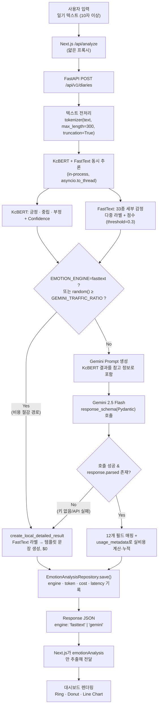
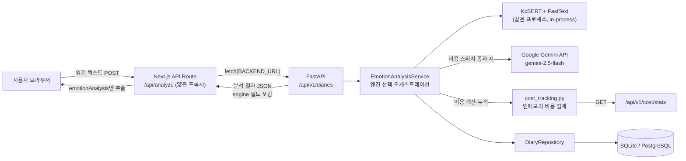
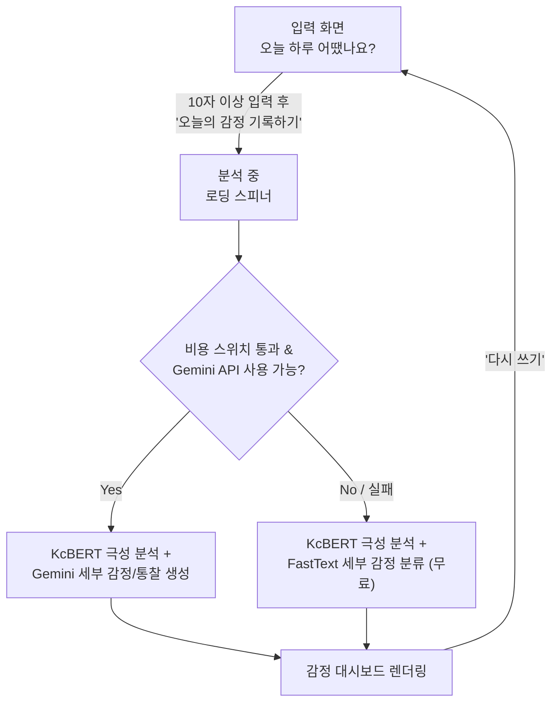

# 오늘의 하루 — 기술 상세 문서

이 문서는 [README.md](../README.md)에서 분리한 설계 배경, 기술 선택 이유, 아키텍처, 실측 비용 데이터를 담고 있습니다.

---

## 목차

- [기획 배경 및 목적](#기획-배경-및-목적)
- [프로젝트 특징](#프로젝트-특징)
- [기술 선택과 이유](#기술-선택과-이유)
- [Technical Decisions](#technical-decisions)
- [AI Pipeline](#ai-pipeline)
- [시스템 아키텍처](#시스템-아키텍처)
- [Frontend Architecture](#frontend-architecture)
- [Scalability](#scalability)
- [Cost Optimization](#cost-optimization)
- [화면 흐름](#화면-흐름)
- [프로젝트 구조](#프로젝트-구조)
- [컴포넌트 설명](#컴포넌트-설명)
- [감정 분류](#감정-분류)
- [감정 색상·아이콘 체계](#감정-색상아이콘-체계)
- [디자인 시스템](#디자인-시스템)
- [알려진 제한사항](#알려진-제한사항)
- [프로젝트 포인트](#프로젝트-포인트)
- [향후 계획](#향후-계획)
- [기대 효과](#기대-효과)

---

## 기획 배경 및 목적

- 감정 일기는 자기 성찰에 효과적이라고 알려져 있지만, 매일 감정을 스스로 언어화하고 분류하는 데는 진입장벽이 있다.
- 사용자는 있었던 일을 편하게 적기만 하면, AI가 글 속 감정의 종류와 원인, 강도를 대신 분석해준다.
- "긍정/부정" 두 단어로 뭉뚱그리지 않고 33가지 세부 감정과 원인·심리 상태·성장 포인트까지 짚어, 하루를 더 깊이 들여다볼 수 있게 한다.
- 로컬 분류 모델(KcBERT)과 생성형 AI(Gemini)를 단계적으로 결합해, Gemini가 응답하지 않는 상황에서도 최소한의 감정 분석 결과를 돌려줄 수 있는 구조를 목표로 했다.
- 나아가 "Gemini 호출을 아예 줄이면 비용이 얼마까지 내려가는가"를 실제로 검증하기 위해, 33종 감정 분류를 CPU 전용 FastText 모델로 대체하는 경로를 직접 만들고 실측 토큰·비용 데이터로 비교했다.
- AI 오케스트레이션을 Next.js API Route(자식 프로세스 IPC)에서 FastAPI 백엔드(in-process 함수 호출 + Controller/Service/Repository 계층 분리)로 옮겨, 백엔드 아키텍처 역량을 보여줄 수 있는 표면을 확보했다. 자세한 설계 배경은 [docs/PORTFOLIO_REDESIGN.md](PORTFOLIO_REDESIGN.md) 참고.

### 타겟 사용자

- 하루를 짧게라도 기록하고 싶지만 형식이나 분량 부담 때문에 일기를 잘 쓰지 못하는 사람
- 자신의 감정 패턴이나 원인을 객관적으로 들여다보고 싶은 사람
- 감정을 표현하는 데 서툴러서 AI의 분석을 통해 자신의 감정을 이해하고 싶은 사람
- 감정 일기 서비스를 사이드 프로젝트로 살펴보고 싶은 개발자·기획자

---

## 프로젝트 특징

- KcBERT(극성 분류) → Gemini(생성) 또는 FastText(무료 다중 라벨 분류) 3단계 감정 분석 파이프라인
- Gemini 응답 실패 시 FastText 기반 상세 분석으로 자동 Fallback
- `GEMINI_TRAFFIC_RATIO` 환경 변수로 Gemini 호출 비율을 0~100% 사이에서 조절하는 비용 스위치
- Gemini 호출마다 실제 `usage_metadata`(토큰 수)를 읽어 비용을 계산·누적하고 `/api/v1/cost/stats`로 조회 가능
- FastAPI 부팅 시점(`lifespan`)에 KcBERT/FastText 모델을 한 번만 로딩해 요청마다 반복되는 모델 로딩 비용 제거
- 일기와 분석 결과(토큰 수·비용·처리 시간 포함)를 SQLAlchemy + Alembic으로 관리하는 DB에 영속 저장
- Next.js는 프론트엔드 렌더링과 얇은 프록시 API Route만 담당하고, AI 오케스트레이션·비용 계산·DB 접근은 전부 FastAPI 백엔드(`backend/`)에 있다
- Apple Activity Ring 스타일의 감정 시각화, Warm Minimal 디자인 시스템

---

## 기술 선택과 이유

각 기술은 "많이 쓰이니까"가 아니라 이 프로젝트가 풀어야 할 구체적인 문제 때문에 골랐습니다.

### Next.js 16 (App Router)

프론트엔드 렌더링과 대시보드 UI를 담당합니다. AI 오케스트레이션은 더 이상 여기 없습니다 — [app/api/analyze/route.ts](../app/api/analyze/route.ts)는 FastAPI 백엔드(`/api/v1/diaries`)로 요청을 전달하고 응답 모양만 맞춰주는 얇은 프록시입니다. 이 프록시를 남겨둔 이유는 두 가지입니다. `DiaryForm.tsx`의 `fetch('/api/analyze')` 호출 경로를 바꾸지 않아도 된다는 점, 그리고 브라우저가 FastAPI 서버 주소(`BACKEND_URL`)를 직접 알 필요가 없어 배포 시 백엔드 위치를 바꿔도 프론트 코드를 건드리지 않아도 된다는 점입니다.

### FastAPI (Python)

원래는 Next.js API Route가 자식 프로세스(`child_process.spawn`)로 Python 추론 서버를 띄우고 stdin/stdout으로 통신하는 구조였습니다. 이 구조를 FastAPI 단일 백엔드로 통합한 이유는 세 가지입니다.

1. **언어 경계 제거** — KcBERT/FastText(Python)를 Node에서 호출하려면 자식 프로세스 IPC가 필요했지만, 백엔드를 Python으로 통일하면 이 IPC 계층 자체가 사라지고 함수 호출로 대체됩니다.
2. **아키텍처 표면 확보** — Router/Service/Repository 계층 분리, Pydantic 기반 요청/응답 검증, SQLAlchemy + Alembic 기반 DB 마이그레이션을 실제로 보여줄 수 있는 구조가 됩니다.
3. **AI 추론 서버로서의 적합성** — Pydantic이 Gemini `response_schema`와 거의 1:1로 대응되는 검증을 자체 제공하고, `async def` 엔드포인트가 Gemini 호출(I/O 대기)과 KcBERT/FastText 추론(CPU 바운드, `asyncio.to_thread`로 위임)을 자연스럽게 분리해 처리합니다.

자세한 설계 배경(왜 Spring Boot/Express가 아닌지 포함)은 [docs/PORTFOLIO_REDESIGN.md §6](PORTFOLIO_REDESIGN.md#6-기술-스택을-선택한-이유) 참고.

### React 19

`use client` 경계를 명시적으로 나누는 것 외에 이 프로젝트가 React 19의 신규 기능을 적극적으로 쓰고 있진 않습니다. 클라이언트 상태가 `DiaryForm.tsx` 한 곳에 몰려 있어, 상태 관리 라이브러리 없이도 `useState` 네 개(`text`, `result`, `error`, `loading`)로 충분했습니다.

### Tailwind CSS v4

디자인 토큰(`--bg`, `--card`, `--primary` 등)을 `globals.css`에 CSS 변수로 두고, 컴포넌트에서는 유틸리티 클래스로 소비하는 구조를 원했습니다. 카드형 컴포넌트가 12개 가까이 반복되는 프로젝트 특성상, `.ds-card` 같은 공통 유틸리티 클래스를 정의해두고 재사용하는 쪽이 유지보수 비용이 낮았습니다.

### 모델 상주 방식: 자식 프로세스 대신 FastAPI lifespan

KcBERT는 PyTorch/Transformers 기반이라 Python 런타임이 필요합니다. 요청마다 모델을 새로 로딩하는 대신, FastAPI의 `lifespan` 이벤트([main.py](../backend/app/main.py))에서 `get_kcbert_classifier()`/`get_fasttext_classifier()`(`functools.lru_cache`)를 한 번만 호출해 모델을 프로세스 경계 없이 상주시킵니다.

### KcBERT

한국어 구어체·신조어에 강한 사전학습 모델이라는 점, 감정 극성 3클래스 분류라는 좁은 문제에 파인튜닝하기 적합한 크기라는 점이 이유입니다. 매 요청마다 외부 API를 호출해 극성만 물어보는 건 비용과 지연 시간 모두 낭비라, 로컬 모델로 먼저 걸러낼 수 있는 문제는 로컬에서 끝내는 편이 낫다고 판단했습니다.

### Gemini 2.5 Flash

33가지 세부 감정, 원인 추론, 심리 통찰, 추천 활동 생성처럼 열린 형태의 자연어 생성은 규칙 기반이나 분류 모델로 대체하기 어렵습니다. 응답 하나가 12개 필드를 한 번에 채워야 해서 응답 지연이 곧바로 체감 로딩 시간이 되기 때문에, Pro 대비 지연 시간과 비용에서 이점이 있는 Flash 계열을 골랐습니다.

다만 Gemini 2.5 Flash는 2026-10-16 지원 종료가 예고되어 있어([가격 페이지](https://ai.google.dev/gemini-api/docs/pricing) 기준), 모델 교체가 예정된 의존성이라는 점도 감안해야 합니다. FastText 경로는 "Gemini가 없어도 서비스가 돌아가는" 구조를 미리 검증해두는 이유이기도 합니다.

### FastText (33종 세부 감정 다중 라벨 분류)

"이 일기가 어떤 감정 라벨에 해당하는가"는 원인 추론이나 통찰 문장 생성과 달리 닫힌 다중 라벨 분류 문제라, 매번 Gemini에게 물어볼 필요가 없다고 판단했습니다.

문제는 라벨링된 한국어 감정 일기 데이터셋이 없다는 점이었습니다. 그래서 33종 감정마다 대표 키워드·문장 시드를 직접 만들고([emotion_keywords.py](../backend/training/emotion_keywords.py)), 이를 템플릿에 채워 학습 코퍼스를 합성하는 weak-supervision 방식으로 부트스트랩했습니다. FastText를 고른 이유는 세 가지입니다.

1. **가볍다** — 학습된 모델(quantize 적용)이 2.4MB로, KcBERT(415MB)의 약 1/170 크기입니다.
2. **빠르다** — 문자 n-gram 기반 얕은 선형 모델이라 학습에 1초 남짓, 추론은 밀리초 단위입니다.
3. **다중 라벨을 자연스럽게 지원한다** — `loss=ova`(One-vs-All)로 학습하면 감정마다 독립적인 확률을 얻을 수 있어, "설렘이면서 동시에 긴장됨" 같은 복합 감정을 소프트맥스보다 자연스럽게 표현합니다.

검증셋(합성 데이터 기준) precision@1 ≈ 0.95, recall@1 ≈ 0.81입니다. 다만 이 수치는 템플릿으로 만든 문장에 대한 자체 검증이라 실제 서비스 정확도를 보장하지 않습니다 — 자세한 한계는 [알려진 제한사항](#알려진-제한사항)에 정리했습니다.

---

## Technical Decisions

기술을 고른 이유보다 더 중요한 건 그 기술들을 어떻게 엮었는가였습니다. 실제로 개발하면서 부딪힌 선택지들입니다.

### Gemini만 쓰지 않은 이유

처음에는 KcBERT 없이 Gemini 하나로 감정 분석 전체를 처리하는 구조도 고려했습니다. 하지만 두 가지가 걸렸습니다.

1. **비용** — 3클래스 극성 분류처럼 단순한 판단까지 매번 생성형 모델을 거치면, 트래픽이 늘었을 때 비용이 요청 수에 그대로 비례합니다.
2. **가용성** — Gemini API가 실패하거나 키가 없을 때 서비스 전체가 멈추는 구조는 감정 일기라는 서비스 특성상 위험합니다.

그래서 극성 분류는 로컬 모델이 담당하고, Gemini는 그 위에 얹는 생성 레이어로 역할을 나눴습니다. 실제로 트래픽이 늘어난다고 가정하고 비용을 계산해보니([Cost Optimization](#cost-optimization) 참고) 최소 응답 경로를 아예 상시로 승격시킬 가치가 있다는 결론에 도달해, FastText로 33종 세부 감정까지 로컬에서 분류하도록 확장했습니다.

### FastText 경로는 언제 타는가

[emotion_analysis.py](../backend/app/services/emotion_analysis.py)의 `EmotionAnalysisService.analyze()`가 매 요청마다 다음 순서로 엔진을 정합니다.

1. `EMOTION_ENGINE=fasttext`이면 무조건 로컬 경로. Gemini API를 아예 호출하지 않는다.
2. 그렇지 않으면 `GEMINI_TRAFFIC_RATIO`(기본값 1, 즉 100%) 확률로 Gemini를 시도한다.
3. Gemini를 시도했는데 API 키가 없거나 호출이 실패하면(`GeminiClientError`), 그 요청 역시 FastText 경로로 떨어진다.

세 경로 모두 최종적으로 같은 함수(`create_local_detailed_result`)를 호출합니다. 사용자 입장에서는 두 경우(의도적 절감 vs 실패로 인한 fallback) 모두 "무료 경로에서 나온 결과"라는 사실이 같고 결과 품질도 동일해야 한다고 판단했기 때문입니다. 이 라우팅 로직은 Gemini·랜덤 함수를 주입해 결정론적으로 단위 테스트합니다([test_emotion_analysis_service.py](../backend/tests/test_emotion_analysis_service.py)) — 실제 Gemini API를 호출하지 않아 비용이 들지 않고 재현 가능합니다. 전체 테스트 전략은 [docs/PORTFOLIO_REDESIGN.md §26](PORTFOLIO_REDESIGN.md#26-테스트-전략) 참고.

### KcBERT를 먼저 수행하는 이유

순서를 바꿔서 Gemini가 먼저 세부 감정을 생성하고 KcBERT로 검증하는 방식도 가능은 합니다. 하지만 그러면 Gemini 호출이 실패했을 때 아무 결과도 남지 않습니다. KcBERT를 먼저 실행하면 항상 응답 가능한 기반선(baseline)을 확보할 수 있고, 이 값을 Gemini 프롬프트에 참고 정보로 함께 넘겨 두 모델의 판단이 크게 어긋나지 않도록 유도할 수 있습니다.

### 모델 상주 — 자식 프로세스 IPC 대신 in-process 함수 호출

Next.js 버전에서는 `child_process.spawn`으로 Python 프로세스를 띄우고 `stdin`/`stdout`으로 JSON을 큐에 순서대로 매칭하는 프로토콜을 직접 짰습니다. 백엔드를 FastAPI(Python)로 통일하면서 이 프로토콜 자체가 필요 없어졌습니다. "프로세스 IPC를 없애는 것"이 이번 재설계의 핵심 통찰이었습니다.

### 얇은 프록시를 남긴 이유

브라우저가 FastAPI를 직접 호출하지 않고 Next.js [app/api/analyze/route.ts](../app/api/analyze/route.ts)를 거치게 한 이유는, 프론트 코드가 백엔드 서버 주소를 몰라도 되게 하기 위해서입니다. `GEMINI_API_KEY`는 이제 `backend/.env`에만 있어, 애초에 브라우저나 Next.js 서버로 노출될 경로 자체가 없습니다.

### Prompt Engineering

Gemini에게 완전히 자유로운 감정 라벨을 생성하게 하면 정의되지 않은 라벨이 튀어나올 수 있고, 그러면 색상·아이콘 매핑이 깨집니다. 그래서 프롬프트에 KcBERT의 극성 결과를 참고 자료로 명시하고, Pydantic `Enum` 필드로 33가지 감정 라벨 밖의 값은 애초에 생성 후보에서 배제했습니다. `aiOneLiner`는 15~35자·마침표 하나·줄바꿈 없음까지 제약을 걸었는데, UI 카드 한 줄에 들어가야 하는 실제 레이아웃 제약에서 역산한 값입니다.

### Structured Output을 사용한 이유

초기에는 자연어 응답을 정규식이나 문자열 파싱으로 필드를 뽑아내는 방식도 생각했지만, 필드가 12개나 되면 파싱이 깨지는 지점이 계속 늘어납니다. `google-genai` SDK에 Pydantic 모델(`GeminiAnalysisSchema`)을 `response_schema`로 넘기면 SDK가 JSON Schema를 자동 생성하고, `response.parsed`로 이미 검증된 인스턴스를 바로 돌려줍니다.

### 실패 처리

`response_schema`가 필드 형태와 enum 값은 보장하지만, API 자체가 실패하거나 `response.parsed`가 `None`인 경우까지 막아주지는 않습니다. 그래서 `classify_with_gemini` 전체를 `try/except`로 감싸 `GeminiClientError` 하나로 통일해서 던지고, `EmotionAnalysisService`가 이 예외 한 지점만 잡아 Fallback으로 넘깁니다.

### Fallback을 만든 이유

Gemini 키가 없거나 호출이 실패해도 사용자는 "오늘 자신이 어떤 감정이었는지"에 대한 답은 받아야 한다고 판단했습니다. 지금의 `create_local_detailed_result`는 FastText의 33종 다중 라벨 분류 결과를 얹어, 상위 감정 1~5개와 각각의 점수를 받아 `causes`, `keywords`, `ai_one_liner`/`ai_message`까지 라벨 조합만으로 채웁니다. 추천 활동은 여전히 극성별 고정 리스트(`FALLBACK_ACTIVITIES`)를 씁니다.

---

## AI Pipeline



파이프라인의 핵심은 세 가지입니다. 첫째, KcBERT와 FastText는 같은 프로세스에서 매 요청마다 항상 함께 돈다는 것 — Gemini 분기 결과와 무관하게 `detailedEmotions`가 항상 채워집니다. 둘째, 어느 단계에서 실패하든 `M` 이전에 항상 FastText 기반 응답(`H`)으로 합류한다는 것입니다. 셋째, 결과가 매번 사라지지 않고 DB에 저장된다는 것입니다.

---

## 시스템 아키텍처



**왜 백엔드를 Python으로 통일했는가** — Node.js에는 PyTorch/Transformers 생태계가 없습니다. 백엔드를 FastAPI(Python)로 통일하면 KcBERT·FastText·Gemini 호출이 전부 같은 프로세스 안의 함수 호출이 됩니다.

**왜 Next.js에 프록시를 남겼는가** — 프론트가 백엔드 서버 주소를 몰라도 되게 하기 위해서입니다. `GEMINI_API_KEY`는 `backend/.env`에만 있어 Next.js 서버조차 이 값을 갖고 있지 않습니다.

**왜 모델을 in-process로 로딩하는가** — 요청마다 모델을 다시 로딩하는 비용을 없애기 위함입니다. FastText도 같은 이유로 같은 프로세스 안에 얹었습니다 — 별도 프로세스로 분리하면 IPC 비용만 늘고, 메모리 비용은 무시할 수준(2.4MB)이기 때문입니다.

**왜 비용 집계를 Service 계층 안에 두는가** — `response.usage_metadata`를 읽을 수 있는 지점이 `classify_with_gemini` 내부뿐이라, 비용 계산도 그 자리에서 바로 하는 게 자연스럽습니다. [cost_tracking.py](../backend/app/services/cost_tracking.py)는 이 계산 로직과 인메모리 누적 통계를 분리해두고, `/api/v1/cost/stats`가 그 값을 그대로 노출합니다. 영구 기록은 `EmotionAnalysis` 테이블의 `input_tokens`/`output_tokens`/`cost_usd` 컬럼에 쌓입니다.

---

## Frontend Architecture

### Component Design

컴포넌트는 대시보드를 구성하는 카드 단위로 쪼갰습니다(`EmotionRingCard`, `EmotionSummaryCard`, `CauseDonutChart`, `WeeklyTrendChart` 등). API 응답 하나가 12개 필드를 갖고 있는데, 카드 단위로 나누면 특정 필드 렌더링 방식이 바뀔 때 해당 파일 하나만 건드리면 됩니다.

### 왜 Card 기반 UI인가

분석 결과가 성격이 다른 정보(대표 감정, 원인 비중, 7일 추이, 추천 활동, 응원 문장)의 묶음이라, 정보 단위별로 카드에 나눠 담는 편이 사용자가 필요한 정보만 골라 보기 쉽습니다.

### 왜 Activity Ring을 사용했는가

대표 감정과 신뢰도라는 두 값을 하나의 시각 요소로 압축해서 보여줘야 했습니다. "오늘 하루가 얼마나 그 감정으로 채워졌는가"라는 감각적인 정보를 전달하는 데 원형 진행률이 숫자 나열보다 직관적이라고 판단했습니다.

### 왜 Warm Minimal인가

감정 일기는 매일 열어보는 서비스라, 화면이 자극적이거나 차가우면 기록하는 행위 자체에 대한 심리적 장벽이 생깁니다. `#F8F4EE` 배경과 보라 포인트 컬러(`#8B74D9`), 여백을 넉넉히 둔 카드 레이아웃으로 채도를 낮추고, 줄노트 배경(`notepad-lines`)과 손글씨 폰트(Gaegu)로 실제 노트에 쓰는 감각에 가깝게 만들었습니다.

### State Flow

전역 상태 관리 라이브러리를 쓰지 않았습니다. 페이지가 사실상 하나(`DiaryForm`)이고, 입력 → 분석 요청 → 결과 렌더링이라는 선형 흐름 안에서만 상태가 움직이기 때문입니다. `text`, `result`, `error`, `loading` 네 개의 `useState`로 전체 화면 상태를 표현합니다. 결과와 일기 원문은 컴포넌트 state에만 존재하며 서버나 브라우저에 저장하지 않습니다(새로고침·'다시 쓰기' 시 초기화).

---

## Scalability

현재 구조는 단일 세션·단일 서버를 전제로 만들었습니다. 트래픽이 늘어난다면 다음 지점부터 병목이 생길 것으로 예상합니다.

- **FastAPI 단일 프로세스** — 지금은 `uvicorn` 워커 하나가 모델을 메모리에 들고 모든 요청을 처리합니다. `asyncio.to_thread`로 이벤트 루프는 막지 않지만, 동시 요청이 늘면 스레드풀이 병목이 됩니다. `uvicorn --workers N`으로 워커를 늘리거나 추론 전용 마이크로서비스로 분리하는 것이 다음 단계입니다.
- **Gemini 호출 비용과 지연** — 요청마다 Gemini를 호출하는 구조라 트래픽이 늘면 비용이 요청 수에 선형으로 비례합니다.
- **캐싱** — 같은 문장을 두 번 분석할 일은 거의 없어 효용은 낮지만, '다시 쓰기'가 반복되는 패턴이라면 최근 KcBERT 결과 정도는 캐싱할 여지가 있습니다.
- **Fallback을 상시 저비용 경로로 승격** — `GEMINI_TRAFFIC_RATIO`로 구현했습니다. 자세한 동작은 [FastText 경로는 언제 타는가](#technical-decisions) 참고.
- **모델 교체 가능성** — 파이프라인이 "텍스트 → 라벨 + 신뢰도"라는 인터페이스(`KcBertLike`/`FastTextLike` `Protocol`)로 분리돼 있어, 같은 인터페이스만 지키면 모델을 교체할 수 있습니다. 더 정교한 한국어 이해가 필요하면 KoBERT, 세부 감정 생성까지 로컬로 옮기고 싶다면 Llama/Gemma 계열 소형 파인튜닝 모델로 교체하는 것도 구조상 가능합니다.
- **Batch 처리** — 현재는 요청 하나당 추론 하나입니다. 동시 요청이 많아지면 짧은 시간 단위로 모아 배치 처리하는 방식도 고려 대상입니다.

---

## Cost Optimization

여기 적힌 수치는 전부 실제로 로컬에서 `/api/analyze`를 호출해 측정한 값입니다(2026-08-09, 가격은 [Gemini API 공식 가격표](https://ai.google.dev/gemini-api/docs/pricing) 기준 Gemini 2.5 Flash `$0.30`/1M input tokens, `$2.50`/1M output tokens).

### 요청 1건당 실제 비용

| 설정 | Input 토큰 | Output 토큰(thinking 포함) | 요청당 비용 |
| -- | --: | --: | --: |
| 기본 설정 (thinking 켜짐) | 269 | 2,334 | $0.005916 |
| `thinkingConfig.thinkingBudget: 0` | 269 | 344 | **$0.000941** |

이 서비스는 "정해진 스키마를 정해진 33개 라벨 안에서 채우는" 닫힌 문제라, thinking 단계의 효용이 낮다고 판단해 `thinking_budget=0`으로 껐습니다. 실측 결과 출력 토큰이 2,334 → 344로 줄면서 **요청당 비용이 약 6.3배 절감**됐습니다.

### 월간 비용 추정 (하루 1회 기록 기준)

| DAU | 월간 요청 수 | Gemini 100% 사용 시 월 비용 |
| --: | --: | --: |
| 100 | 3,000 | $2.82 |
| 1,000 | 30,000 | $28.22 |
| 10,000 | 300,000 | $282.21 |
| 100,000 | 3,000,000 | $2,822.10 |

### FastText 경로로 트래픽을 돌리면 얼마까지 내려가는가

DAU 10,000명 기준 비율별 월 비용:

| GEMINI_TRAFFIC_RATIO | Gemini 비율 | 월 비용 (DAU 10,000) |
| --: | --: | --: |
| 1.0 (기본값) | 100% | $282.21 |
| 0.5 | 50% | $141.11 |
| 0.1 | 10% | $28.22 |
| 0.0 | 0% | **$0.00** |

`0.0`은 `EMOTION_ENGINE=fasttext`로 강제한 것과 동일한 결과입니다.

### 로컬 모델 두 개의 비용 특성 비교

| | KcBERT (극성 3-class) | FastText (세부 감정 33-class) |
| -- | -- | -- |
| 모델 크기 | 415.6MB | 2.4MB (quantize 적용, 약 1/171) |
| 런타임 | PyTorch, Transformers | 순수 CPU 선형 모델 |
| 학습 데이터 | 라벨링된 데이터셋으로 파인튜닝 | 키워드 시드 기반 weak-supervision 합성 데이터 |
| 요청당 과금 | $0 (로컬 추론) | $0 (로컬 추론) |
| 정확도 | (파인튜닝 데이터셋 기준) | 자체 검증셋 precision@1 ≈ 0.95, recall@1 ≈ 0.81 |

### 종합

- Gemini만 쓰는 구조라면 DAU 10,000명 기준 월 $282.21 (thinking을 끄지 않았다면 $1,774.71).
- `GEMINI_TRAFFIC_RATIO`를 조절하면 이 비용을 품질과 맞바꿔 원하는 지점까지 낮출 수 있고, 극단적으로는 $0까지 수렴시킬 수 있다.
- CPU 추론(KcBERT + FastText)은 요청량과 무관하게 과금되지 않지만, 서버 리소스는 계속 점유한다.

---

## 화면 흐름



- 단일 페이지 애플리케이션(SPA) 구조로, 입력 → 분석 → 결과 표시가 한 화면 안에서 전환된다.
- 별도의 로그인·회원가입 없이 바로 사용할 수 있다.
- 분석 결과와 일기 원문은 서버나 브라우저에 저장되지 않으며, 새로고침하거나 '다시 쓰기'를 누르면 초기화된다.

---

## 프로젝트 구조

```text
emotional-diary/
├── app/
│   ├── api/
│   │   ├── analyze/route.ts      # 감정 분석 API 프록시
│   │   └── cost/route.ts          # 비용/토큰 통계 조회 API
│   ├── components/
│   │   ├── DiaryForm.tsx          # 일기 입력 폼 및 대시보드 레이아웃
│   │   ├── EmotionRingCard.tsx
│   │   ├── EmotionSummaryCard.tsx
│   │   ├── EmotionTop3Card.tsx
│   │   ├── CauseDonutChart.tsx
│   │   ├── WeeklyTrendChart.tsx
│   │   ├── DiaryEntry.tsx
│   │   ├── AiMemo.tsx
│   │   ├── ActivitiesCard.tsx
│   │   ├── QuoteCard.tsx
│   │   ├── EmotionDetailSummary.tsx
│   │   └── EmotionChart.tsx
│   ├── lib/
│   │   └── emotion-theme.ts       # 33가지 감정 → 색상/아이콘/기분 점수 매핑
│   ├── globals.css
│   ├── layout.tsx
│   └── page.tsx
│
└── backend/
    ├── app/
    │   ├── main.py                # FastAPI 앱, lifespan에서 모델 예열
    │   ├── core/config.py
    │   ├── api/v1/                # Router 계층 (diaries, cost)
    │   ├── services/
    │   │   ├── emotion_analysis.py
    │   │   ├── cost_tracking.py
    │   │   └── ai/                # kcbert.py, fasttext_classifier.py, gemini_client.py
    │   ├── repositories/
    │   ├── models/                # User, Diary, EmotionAnalysis (ORM)
    │   └── schemas/
    ├── models/                    # KcBERT, FastText 모델 바이너리 (Git LFS)
    ├── training/                  # FastText 학습 스크립트 + 시드 키워드
    ├── alembic/
    └── tests/
```

---

## 컴포넌트 설명

| 컴포넌트 | 설명 |
| -- | -- |
| DiaryForm | 일기 입력 폼과 대시보드 전체 레이아웃 구성 |
| EmotionRingCard | 오늘의 대표 감정을 원형 진행률(Apple Activity Ring 스타일)로 표시 |
| EmotionSummaryCard | 감정 퍼센트, 신뢰도 바, 감정 강도(5점 척도), AI 한 줄 분석, 오늘의 키워드 |
| EmotionTop3Card | 감정 분포 상위 3개를 바 형태로 표시 |
| CauseDonutChart | 감정 원인과 비중을 도넛 차트로 표시 |
| WeeklyTrendChart | `GET /api/diaries`로 최근 일기를 조회해 7일간 감정 변화를 라인 차트로 표시. 기록이 없는 날은 "기록 없음"으로 표시 |
| DiaryEntry | 작성한 일기 원문을 줄노트 배경 위에 손글씨 폰트로 표시 |
| AiMemo | AI 코멘트(2~3문장)를 줄노트 배경 카드로 표시 |
| ActivitiesCard | 오늘의 감정에 맞는 AI 추천 활동 4가지를 아이콘과 함께 표시 |
| QuoteCard | 오늘 하루를 위한 응원 문장을 좋아요 버튼과 함께 표시 |
| EmotionDetailSummary | 심리 상태·주요 원인·성장 포인트·내일의 나에게를 4개 카드로 표시 |
| EmotionChart | 감지된 전체 감정을 강도순으로 시각화하는 막대 차트 |

---

## 감정 분류

KcBERT가 먼저 3가지 극성을 분류하면, Gemini가 이를 참고해 아래 33가지 세부 감정 중 최대 5개를 강도순으로 생성합니다.

| 극성 | 세부 감정 |
| -- | -------- |
| 긍정 | 행복, 사랑, 설렘, 감사, 안도, 자부심, 경외감, 평화로움, 흥분, 만족, 안심, 편안함, 기대, 감동 |
| 부정 | 슬픔, 분노, 불안, 혐오, 죄책감, 수치심, 질투, 외로움, 무기력, 후회 |
| 중립 | 놀람, 지루함, 피곤함, 혼란, 당황, 긴장 |

Gemini API를 쓰지 않는 경우에도 FastText가 33종 세부 감정을 분류해주므로, 극성 3종으로만 뭉뚱그려지지는 않습니다. 다만 FastText 예측에 확신이 가는 라벨이 하나도 없으면(threshold 미만) KcBERT의 극성 결과로 대체됩니다.

---

## 감정 색상·아이콘 체계

33가지 감정 각각이 고유한 색상과 표정 이모지를 가집니다.

| 극성 | 색상 범위 | 예시 |
| -- | -------- | ---- |
| 긍정 | 황토 ~ 골드 | 행복 😄, 사랑 🥰, 설렘 🤩, 기대 🤗 |
| 부정 | 슬레이트 ~ 인디고 | 슬픔 😢, 분노 😡, 죄책감 😓, 외로움 🥺 |
| 중립 | 세이지 ~ 그레이 | 놀람 😲, 혼란 😵‍💫, 긴장 😬 |

이 색상·이모지는 감정 진행률 링, 차트, 배지 등 대시보드 전반에서 일관되게 사용되며, `WeeklyTrendChart`는 감정별 기분 점수(effect 기반)로 7일 변화 그래프의 오늘 포인트 위치를 계산합니다.

---

## 디자인 시스템

**Warm Minimal Design System** — Apple HIG, Material 3, Notion, Muji 톤을 참고해 만든 카드 기반 UI 체계입니다.

### 컬러 토큰 (`globals.css`)

| 토큰 | 값 | 용도 |
| -- | -- | -- |
| `--bg` | `#F8F4EE` | 페이지 배경 |
| `--card` | `#FFFFFF` | 카드 배경 |
| `--primary` | `#8B74D9` | 포인트 컬러(보라) |
| `--secondary` | `#F5F2FF` | 태그·강조 배경 |
| `--border` | `#E8E3DA` | 카드 테두리 |
| `--text` / `--sub-text` | `#2B2B2B` / `#6D6D6D` | 본문 / 보조 텍스트 |

### 공통 유틸리티 클래스

- `.ds-card` / `.ds-card-hover` — 흰 배경, 1px 보더, radius 20px, 옅은 그림자, hover 시 `translateY(-2px)`
- `.ds-tag` — pill 형태 키워드 태그
- `.ds-progress-track` / `.ds-progress-fill` — 둥근 진행 바
- `.fade-up` — 페이지 로드 시 섹션이 아래에서 위로 살짝 떠오르는 애니메이션
- `.notepad-lines` — 줄노트 배경(가로 룰선)

### 노트 컨셉

- 입력창과 오늘의 기록 카드에 왼쪽 빨간 여백선 또는 줄노트 배경 적용
- 일기 원문은 Gaegu 손글씨 폰트로 표시
- AI 코멘트·오늘의 문장 카드도 같은 줄노트 배경을 공유해 전체 카드가 하나의 노트북처럼 읽히도록 함

---

## 알려진 제한사항

- 분석 결과는 백엔드 DB에 저장되지만, 프론트에는 아직 히스토리를 조회하는 화면이 없습니다. `GET /api/v1/diaries`로 조회는 가능하지만 UI가 연결되지 않아, 새로고침하거나 '다시 쓰기'를 누르면 화면상으로는 사라집니다.
- `WeeklyTrendChart`는 실제 DB 데이터를 조회해 최근 7일을 그리지만, `EmotionRingCard`의 '어제보다 +N%' 배지는 여전히 고정된 샘플 값입니다.
- 필드 단위 검증(zod 등)은 프론트에 아직 없고, 백엔드의 Pydantic `response_schema` + `GeminiClientError` 조합으로만 방어하고 있습니다.
- 로그인·인증이 없어 `Diary.user_id`가 항상 비어 있습니다(모든 일기가 익명 사용자 소유). 인증은 다음 단계로 설계돼 있습니다([docs/PORTFOLIO_REDESIGN.md §25 Phase 2](PORTFOLIO_REDESIGN.md#25-개발-단계별-구현-계획)).
- FastText 분류기는 사람이 라벨링한 실제 일기 데이터가 아니라 키워드 시드로 합성한 문장으로 학습했습니다(weak supervision). 실제 사용자 문장(특히 반어법·은유·복합 감정)에서는 정확도가 낮을 수 있습니다.
- `/api/v1/cost/stats`의 비용 통계는 서버 프로세스 메모리에만 있는 값이라, 재배포·재시작하면 초기화됩니다.
- 프론트(Next.js)와 백엔드(FastAPI)를 각각 별도 프로세스로 띄워야 합니다 — 백엔드가 꺼져 있으면 `/api/analyze` 프록시가 실패합니다.

---

## 프로젝트 포인트

- Next.js API Route가 자식 프로세스로 Python을 제어하던 구조를, FastAPI 백엔드로 통합해 Controller(Router)/Service/Repository 3계층으로 재설계
- 로컬 AI 모델(KcBERT + FastText)을 FastAPI `lifespan`에서 한 번만 로딩해 in-process로 서빙
- Gemini Structured Output(Pydantic `response_schema`)을 활용한 안정적인 응답 파싱
- Gemini 장애 시 FastText 기반 자동 Fallback으로 서비스 연속성 확보 (극성 3종이 아닌 33종 세부 감정 수준까지)
- 실제 `usage_metadata` 기반 Gemini 비용 실시간 계산·집계, `thinking_budget` 튜닝으로 요청당 비용 6.3배 절감 실측
- `GEMINI_TRAFFIC_RATIO` 환경 변수로 Gemini ↔ FastText 트래픽을 조절해 비용을 원하는 지점까지 낮추는 비용 스위치 구현
- 라벨링 데이터 없이 키워드 시드 + weak supervision으로 FastText 다중 라벨 분류기 부트스트랩 (모델 크기 1/171, CPU 전용)
- SQLAlchemy 2.0(async) + Alembic으로 일기·분석 결과를 DB에 영속화
- `EmotionAnalysisService`의 엔진 라우팅 로직을 mock으로 결정론적 단위 테스트
- Ring · Donut · Line · 막대 차트를 조합한 감정 데이터 시각화 UI 구현

---

## 향후 계획

- [x] ~~히스토리 저장 기능 (데이터베이스 연동)~~ — 백엔드에 구현 완료, 프론트 조회 화면은 아직
- [ ] 히스토리 조회 화면 (캘린더 뷰 포함) — `GET /api/v1/diaries`를 소비하는 프론트 UI
- [ ] 사용자 로그인 및 계정별 기록 관리 (JWT 인증)
- [ ] 감정 통계 · 월간 리포트
- [ ] 모델 성능 개선
- [ ] FastText 분류기를 합성 데이터 대신 실제 사용자 일기(익명화) + 사람 검수 라벨로 재학습
- [ ] `/api/v1/cost/stats`를 DB 집계 기반으로 바꿔 재배포 후에도 유지
- [ ] 배포 환경 구성 (Frontend: Vercel / Backend: Docker)

---

## 기대 효과

- 감정을 스스로 분류하거나 언어화해야 하는 부담 없이, 사용자는 글만 작성하면 감정 인사이트를 얻을 수 있다
- 원인·심리 상태·성장 포인트까지 함께 제시되어, 단순 기록을 넘어 자기 이해를 돕는 도구로 기능한다
- 로컬 분류 모델(KcBERT, FastText)과 생성형 AI(Gemini)를 결합한 파이프라인과 비용 스위치(`GEMINI_TRAFFIC_RATIO`)를 통해, 외부 API 장애 상황에서도 서비스 연속성을 확보하고 트래픽이 늘어도 비용을 통제 가능한 범위로 유지하는 구조를 검증할 수 있다
