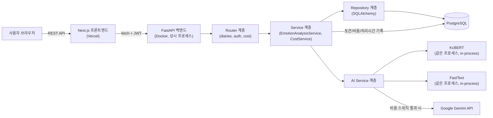
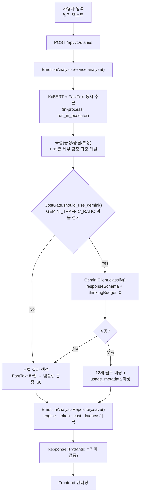
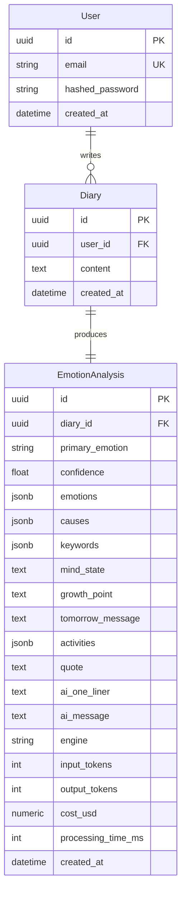

# 오늘의 하루 — 포트폴리오 재설계 문서 (v2: FastAPI + DB)

> **업데이트 (2026-08-09): Phase 1 구현 완료 + `BE/` 제거.** 이 문서는 원래 설계 문서로 작성되었지만, [25. 개발 단계별 구현 계획](#25-개발-단계별-구현-계획)의 Phase 1(FastAPI 스캐폴딩 + DB 스키마 + KcBERT/FastText/Gemini 로직 이관)은 이제 `backend/` 디렉토리에 실제 코드로 존재하고, 서버를 띄워 `POST /api/v1/diaries`가 DB에 저장되는 것까지 실측으로 확인했습니다(실행 방법은 [README.md 실행 방법](../README.md#실행-방법) 참고). 이어서 Next.js가 자식 프로세스로 띄우던 옛 Python 서버(`BE/`, `app/lib/inferServer.ts`, `app/lib/geminiCost.ts`, `instrumentation.ts`)를 전부 제거하고, `app/api/analyze/route.ts`/`app/api/cost/route.ts`를 FastAPI로 요청을 전달하는 얇은 프록시로 재작성했습니다 — 지금은 AI 로직의 원본이 `backend/` 하나뿐입니다. Phase 2(인증) 이후는 여전히 설계 단계입니다. 아래 본문의 "아직 구현하지 않았다"는 서술은 Phase 2~4에 대해서만 유효합니다.
>
> **이 문서에서 "실측"이라고 적은 숫자는 실제로 이 저장소에서 서버를 띄우고 `/api/analyze`를 호출해 측정한 값입니다.** 아직 만들지 않은 FastAPI/DB에 대한 숫자는 "설계값"이라고 표기했고, 실제로 API 키를 넣어 호출해보지 않은 타사 모델(OpenAI) 가격은 "공식 가격표 인용, 실측 아님"이라고 명시했습니다. 이 구분 자체가 리뷰어가 지적한 "숫자를 지어내지 말라"는 요구에 대한 답입니다.

---

## 1. 프로젝트 한 줄 소개

하루를 자유롭게 기록하면 로컬 분류 모델(KcBERT·FastText)과 생성형 AI(Gemini)를 비용 스위치로 엮은 하이브리드 파이프라인이 감정을 분석해주는 AI 감정 일기 서비스. 핵심은 "AI 기능을 붙였다"가 아니라 **"이 AI 기능이 트래픽에 따라 얼마가 들고, 그 비용을 어떻게 통제 가능한 범위로 만들었는가"**를 실측 데이터로 증명하는 것.

## 2. 프로젝트 목표

* 감정 일기라는 기능 자체보다 **AI 기능의 비용·성능·장애 대응을 엔지니어링한 흔적**을 남긴다.
* LLM API 하나에 의존하지 않고, 문제의 성격(닫힌 분류 vs 열린 생성)에 따라 모델을 나눠 쓰는 **Hybrid AI Architecture**를 실제로 구현하고 실측으로 검증한다.
* 프론트(Next.js)와 백엔드(FastAPI)를 분리해, 각 계층이 책임지는 문제와 그 경계를 명확히 설계한다.
* 면접에서 "이 아키텍처를 왜 이렇게 짰는가"라는 질문에 숫자와 근거로 답할 수 있는 상태를 만든다.

## 3. 문제 정의

### 문제 1 — 감정 분석을 LLM에만 의존하면 트래픽에 비례해 비용이 커진다

33종 세부 감정 분류처럼 닫힌 문제까지 매번 Gemini/GPT/Claude 같은 생성형 API를 호출하면, 사용자가 늘어날수록 비용이 요청 수에 선형으로 비례한다(§16 참고). 이 구조는 "AI 기능이 있다"까지는 보여줘도 "그 기능을 운영 가능하게 만들었다"는 보여주지 못한다.

### 문제 2 — Next.js API Route 하나로는 아키텍처를 보여줄 표면이 없다

현재 구조(Next.js API Route가 Python 자식 프로세스를 stdin/stdout으로 제어)는 실제로 동작하지만, Controller/Service/Repository 같은 계층 분리, DB 설계, 인증/인가, 관측 가능성(observability) 같은 백엔드 설계 역량을 보여줄 표면적이 없다. Python AI 생태계(PyTorch, FastText, transformers)와 백엔드 서버가 서로 다른 언어라, IPC(stdin/stdout)라는 우회로가 필요했던 것도 이 구조의 한계다.

### 문제 3 — 감정 기록이 저장되지 않아 "감정 일기" 서비스의 핵심 가치가 검증되지 않는다

지금은 DB가 없어 새로고침하면 기록이 사라진다. 감정 패턴을 시간에 따라 추적한다는 서비스의 존재 이유 자체가 미완성 상태다.

## 4. 핵심 기능

| 기능 | 상태 |
| -- | -- |
| 일기 작성 + AI 감정 분석 (KcBERT + FastText + Gemini 하이브리드) | ✅ 구현 완료 (Next.js 버전, FastAPI 버전 둘 다) |
| Gemini 트래픽 비율 조절로 비용 제어 (`GEMINI_TRAFFIC_RATIO`) | ✅ 구현 완료 (양쪽 버전) |
| 실시간 비용 집계 (`/api/cost`, `/api/v1/cost/stats`) | ✅ 구현 완료 (인메모리, 양쪽 버전) |
| FastAPI 백엔드 분리 | ✅ 구현 완료 (`backend/`, Phase 1) |
| 일기·분석 결과 영속 저장 (DB) | ✅ 구현 완료 (`backend/`의 SQLite/PostgreSQL, Phase 1) |
| 사용자 계정 및 로그인 | ⬜ Phase 2 |
| 감정 히스토리 조회 / 캘린더 뷰 | ⬜ Phase 2 (API는 `GET /diaries`로 이미 가능, 프론트 미연결) |
| 비용·성능 대시보드 (DB 기반) | ⬜ Phase 3 |

## 5. 기술 스택

| 분야 | 기술 |
| -- | -- |
| Frontend | Next.js 16 (App Router, 프론트 전용), React 19, TypeScript, TanStack Query, Tailwind CSS v4 |
| Backend | FastAPI, Python 3.11, Pydantic v2, SQLAlchemy 2.0 (async) + Alembic |
| Database | PostgreSQL (배포), SQLite (로컬 개발) |
| AI | KcBERT-base(PyTorch), FastText(CPU 다중 라벨 분류), Google Gemini API(`gemini-2.5-flash`) |
| Auth | FastAPI 자체 JWT 발급 (액세스/리프레시 토큰), `passlib[bcrypt]` |
| 관측 | 구조화 로깅(`structlog`), DB 적재 기반 비용/성능 집계 |
| 배포 | Frontend: Vercel / Backend: Docker + Fly.io 또는 Railway (AI 모델 로딩 때문에 서버리스보다 상시 컨테이너가 유리) |

## 6. 기술 스택을 선택한 이유

### 왜 Next.js API Route가 아니라 FastAPI인가

지금 구조가 이미 잘 동작하는데도 백엔드를 분리하는 이유는 세 가지다.

1. **언어 경계 제거** — Phase 0(Next.js 버전)에서는 Next.js(Node)가 KcBERT/FastText(Python)를 자식 프로세스로 띄우고 stdin/stdout JSON 한 줄씩으로 통신했다(`inferServer.ts`, Phase 1에서 제거됨). 이 IPC 계층은 "Node에는 PyTorch 생태계가 없다"는 문제를 우회하기 위한 것이었다. 백엔드를 통째로 Python(FastAPI)으로 옮기면 KcBERT·FastText·Gemini 호출이 전부 같은 프로세스 안의 함수 호출이 되고, 이 IPC 프로토콜 자체가 사라진다. "AI 서버를 분리한 이유"가 아니라 "애초에 분리할 필요가 없어지는 것"이 이번 재설계의 핵심 통찰이다 — Phase 1 구현 후 `app/lib/inferServer.ts`, `app/lib/geminiCost.ts`, `instrumentation.ts`, `BE/`를 모두 삭제해 이 통찰을 실제 코드에 반영했다.
2. **아키텍처 표면 확보** — Controller(Router)/Service/Repository 분리, Pydantic 기반 요청/응답 검증, 의존성 주입(DB 세션, 인증 사용자)을 실제로 보여줄 수 있는 구조가 된다.
3. **AI 추론 서버로서의 적합성** — Pydantic이 Gemini `responseSchema`와 거의 1:1로 대응되는 스키마 검증을 자체적으로 제공하고, `async def` 엔드포인트가 Gemini 호출(I/O 대기)과 로컬 모델 추론(CPU 바운드)을 자연스럽게 분리해 처리할 수 있다.

**왜 Spring Boot나 Express가 아닌가** — Spring Boot(JVM)와 Express(Node)는 둘 다 Python AI 생태계와 같은 언어 경계 문제를 그대로 갖는다. 이 서비스의 백엔드 로직 대부분이 "AI 모델 오케스트레이션"이라, AI 런타임과 API 서버가 같은 언어인 것의 이득이 프레임워크 성숙도 차이보다 크다고 판단했다.

### 왜 PostgreSQL인가

`EmotionAnalysis`가 감정 배열(`emotions`), 원인 배열(`causes`), 키워드 배열(`keywords`) 같은 반정형 데이터를 갖는다(§11). PostgreSQL의 `JSONB` 컬럼으로 이 필드들을 저장하면서도, `primaryEmotion`이나 `createdAt` 같은 핵심 필드는 일반 컬럼으로 인덱싱할 수 있어 "반정형 데이터 + 정형 쿼리"라는 이 서비스의 요구에 맞다. 로컬 개발은 SQLite로 충분해 Docker 없이 바로 개발을 시작할 수 있고, SQLAlchemy가 두 방언을 추상화해준다.

### 왜 TanStack Query인가

프론트가 FastAPI를 직접 호출하는 구조로 바뀌면서, 지금 `DiaryForm.tsx`의 `useState` 4개(`text`/`result`/`error`/`loading`)로 충분했던 상태 관리로는 "히스토리 목록 캐싱", "재검증", "낙관적 업데이트" 같은 서버 상태 관심사를 감당하기 어렵다. TanStack Query가 이 캐싱·재검증 로직을 표준화해준다. 전역 상태 관리 라이브러리(Redux, Zustand)는 여전히 불필요하다 — 이 앱의 상태는 거의 전부 "서버에서 가져온 데이터"이지 클라이언트 전용 상태가 아니기 때문이다.

## 7. 전체 시스템 아키텍처



이 아키텍처의 핵심은 **AI 모델이 별도 프로세스가 아니라 FastAPI 애플리케이션 안의 모듈**이라는 것이다. Next.js 버전에서 `instrumentation.ts`가 서버 부팅 시 Python 자식 프로세스를 예열해야 했던 이유(모델 로딩 비용)는 그대로 남지만, 이제는 "FastAPI 프로세스 시작 시 모델을 메모리에 올려두는" `lifespan` 이벤트([main.py](../backend/app/main.py)) 하나로 해결된다 — 상주 프로세스라는 개념은 유지하되, 프로세스 경계(IPC)는 없앤다. `instrumentation.ts`는 더 이상 필요 없어 Phase 1에서 삭제했다.

## 8. Frontend 아키텍처

```text
app/
├── (routes)/
│   ├── page.tsx                  # 일기 작성 페이지
│   ├── history/page.tsx          # 감정 히스토리
│   └── login/page.tsx
│
├── components/
│   ├── ui/                       # 디자인 시스템 원자 단위
│   │   ├── Button.tsx
│   │   ├── Input.tsx
│   │   ├── Card.tsx
│   │   └── Modal.tsx
│   └── EmotionBadge.tsx          # 감정 라벨 + 색상 + 아이콘 (기존 emotion-theme.ts 재사용)
│
├── features/
│   ├── diary/
│   │   ├── components/           # DiaryForm, DiaryEntry 등 (기존 컴포넌트 이관)
│   │   ├── hooks/                # useDiarySubmit, useDiaryHistory (TanStack Query)
│   │   ├── api/                  # diaryApi.ts — FastAPI 호출 함수
│   │   └── types.ts
│   └── emotion-dashboard/
│       ├── components/           # EmotionRingCard, CauseDonutChart 등 (기존 컴포넌트 이관)
│       └── hooks/
│
├── lib/
│   ├── apiClient.ts               # fetch 래퍼 + JWT 첨부 + 401 처리
│   └── emotion-theme.ts           # 기존 파일 그대로 이관
│
└── types/
    └── api.ts                    # FastAPI Pydantic 스키마와 대응하는 TS 타입
```

**기존 컴포넌트는 대부분 그대로 재사용한다.** `EmotionRingCard`, `CauseDonutChart`, `WeeklyTrendChart` 같은 대시보드 컴포넌트는 API 통신 방식과 무관하게 "분석 결과 객체를 받아 그린다"는 인터페이스를 유지하므로, `features/emotion-dashboard/components/`로 이동만 하면 된다. 바뀌는 것은 그 데이터를 어디서 가져오는가(`fetch('/api/analyze')` → `useDiarySubmit()` 훅)뿐이다.

**`features/` 단위로 나눈 이유** — 지금은 페이지가 사실상 하나라 `components/`만으로 충분했지만, 히스토리 페이지가 추가되면 "일기 작성"과 "히스토리 조회"가 서로 다른 API·훅·타입을 갖는 독립된 기능 단위가 된다. 기능별로 폴더를 나누면 한 기능을 삭제하거나 리팩터링할 때 영향 범위가 그 폴더 안으로 국한된다.

## 9. FastAPI Backend 아키텍처

Phase 1 구현 시점 기준 실제 트리(`auth.py`/`security.py`는 Phase 2에서 추가 예정, 그 외는 계획대로 구현됨):

```text
backend/
├── app/
│   ├── main.py                    # FastAPI 앱 생성, lifespan(모델 로딩), 라우터 등록
│   ├── core/
│   │   └── config.py               # Pydantic Settings (환경 변수) — security.py는 Phase 2(JWT)에서 추가
│   │
│   ├── api/
│   │   └── v1/
│   │       ├── diaries.py          # POST /diaries, GET /diaries, GET /diaries/{id} — auth.py는 Phase 2
│   │       └── cost.py             # GET /cost/stats
│   │
│   ├── services/
│   │   ├── emotion_analysis.py     # 엔진 선택(Gemini/FastText) + 오케스트레이션
│   │   ├── cost_tracking.py        # 토큰 → 비용 계산, 인메모리 집계
│   │   └── ai/
│   │       ├── kcbert.py           # 극성 분류 (in-process)
│   │       ├── fasttext_classifier.py  # 33종 세부 감정 분류 (in-process)
│   │       ├── gemini_client.py    # Gemini 호출 + usage_metadata 파싱
│   │       ├── gemini_schema.py    # response_schema로 쓰는 Pydantic 모델
│   │       └── emotion_labels.py   # 33종 감정 라벨 (emotion-theme.ts와 동기화)
│   │
│   ├── repositories/
│   │   └── diary_repository.py    # Diary + EmotionAnalysis를 함께 저장/조회 (1:1 관계라 리포지토리 하나로 통합)
│   │
│   ├── models/                    # SQLAlchemy ORM 모델 — 아래 top-level backend/models/(AI 바이너리)와 이름은 같지만 다른 디렉토리
│   │   ├── user.py
│   │   ├── diary.py
│   │   └── emotion_analysis.py
│   │
│   ├── db/
│   │   └── session.py             # AsyncSession 팩토리
│   │
│   └── schemas/                   # Pydantic 요청/응답 스키마
│       ├── diary.py
│       └── emotion_analysis.py
│
├── models/                         # AI 모델 바이너리 (Git LFS) — app/models/(ORM)와 다른 디렉토리
│   ├── kcbert/                     # KcBERT fine-tuned 3-class 모델 (~415MB)
│   └── fasttext/
│       └── emotion_ft.bin          # FastText 33-class 다중 라벨 분류기 (quantized, ~2.4MB)
│
├── training/                       # FastText 학습 스크립트
│   ├── emotion_keywords.py         # 33종 세부 감정 시드 키워드
│   ├── train_fasttext.py           # weak-supervision 학습 스크립트
│   └── data/                       # 합성 학습/검증 코퍼스
│
├── alembic/                        # DB 마이그레이션
├── tests/
└── pyproject.toml
```

`app/models/`(SQLAlchemy ORM)와 `models/`(AI 모델 바이너리)의 이름이 겹치는 건 의도한 것은 아니고, "이미 있던 `models/` 관례(ORM)"와 "옮겨온 `BE/model` 관례(AI 바이너리)"가 같은 저장소에서 만난 결과다. 두 디렉토리가 계층이 달라(`app/models/` vs top-level `models/`) 실제 임포트 경로가 겹치진 않지만, 향후 리네이밍(`models/` → `ml_models/` 등)을 고려할 만한 지점으로 남겨둔다.

### Controller(Router) / Service / Repository 역할 분리

* **Router(`api/v1/*.py`)** — HTTP 요청/응답 변환만 담당한다. Pydantic 스키마로 요청 본문을 검증하고, Service를 호출하고, 결과를 직렬화해 반환한다. 비즈니스 로직을 두지 않는다.
* **Service(`services/*.py`)** — "일기를 받으면 KcBERT/FastText/Gemini 중 무엇으로 분석할지 결정하고, 결과를 정규화하고, 비용을 계산해 기록한다" 같은 실제 도메인 로직을 둔다. Router나 DB 세션 구현에 의존하지 않아 단위 테스트가 쉽다(§26).
* **Repository(`repositories/*.py`)** — SQLAlchemy 쿼리를 캡슐화한다. Service는 "이 사용자의 최근 7일 일기를 달라"고만 요청하고, 실제 쿼리 작성(join, 정렬, 페이지네이션)은 Repository가 담당한다. DB를 PostgreSQL에서 다른 저장소로 바꿔야 할 때 Service 코드를 건드리지 않아도 되는 경계다.

이 3계층 분리가 실제로 가치를 내는 지점은 **AI 엔진 선택 로직(`EmotionAnalysisService`)을 Router나 DB 구현과 무관하게 단위 테스트할 수 있다는 것**이다 — GEMINI_TRAFFIC_RATIO에 따른 라우팅 분기, Gemini 실패 시 폴백 같은 로직은 HTTP나 DB 없이도 검증 가능해야 한다(§26).

### 왜 async인가

Gemini 호출은 네트워크 I/O 대기가 대부분이고, KcBERT/FastText 추론은 CPU 바운드다. `async def` 엔드포인트 + `httpx.AsyncClient`(또는 `google-genai`의 비동기 클라이언트)로 Gemini 호출을 논블로킹으로 처리하면, 그 대기 시간 동안 다른 요청의 로컬 모델 추론을 이벤트 루프가 처리할 수 있다. CPU 바운드인 KcBERT/FastText 추론 자체는 `run_in_executor`로 스레드 풀에 위임해 이벤트 루프를 막지 않는다.

## 10. AI Pipeline



기존 Next.js 구현과 파이프라인의 **판단 로직은 동일**하다(비용 스위치, Gemini 실패 시 FastText 폴백). 바뀌는 것은 이 로직이 실행되는 위치뿐이다 — Node가 Python 프로세스에 메시지를 보내던 자리가, 같은 Python 프로세스 안의 함수 호출로 대체된다. 그리고 결과가 이제는 매번 사라지지 않고 `EmotionAnalysisRepository.save()`로 영속화된다.

## 11. Database ERD



**`EmotionAnalysis`에 `engine`/`input_tokens`/`output_tokens`/`cost_usd`/`processing_time_ms`를 둔 이유** — 요청 원문 스펙(§11)이 요구한 "AI 비용/성능을 측정할 수 있는 설계"를 문자 그대로 반영한 것이다. 이 컬럼들이 있어야 §16의 비용 계산과 §19의 성능 측정이 "코드 실행 시점의 실측"이 아니라 "누적된 실 데이터 기반 집계"가 된다 — 지금 Next.js 버전의 `/api/cost`가 서버 재시작 시 초기화되는 인메모리 집계인 것과 달리, DB에 쌓이면 "지난 한 달 평균 비용" 같은 질문에 답할 수 있다.

**`primaryEmotion`, `confidence` 등 핵심 필드를 일반 컬럼으로 분리하고 나머지를 JSONB에 담은 이유** — "최근 7일 대표 감정 추이"처럼 자주 조회할 필드는 인덱스를 태울 수 있는 일반 컬럼으로, `causes`/`keywords`/`activities`처럼 구조가 고정적이지 않고 그대로 프론트에 내려주기만 하면 되는 필드는 JSONB로 나눴다.

## 12. API 설계

| Method | Path | 설명 | 인증 |
| -- | -- | -- | -- |
| POST | `/api/v1/auth/register` | 회원가입 | - |
| POST | `/api/v1/auth/login` | 로그인, JWT 발급 | - |
| POST | `/api/v1/diaries` | 일기 작성 + AI 분석 (동기 응답) | 필요 |
| GET | `/api/v1/diaries` | 내 일기 목록 (페이지네이션, 기간 필터) | 필요 |
| GET | `/api/v1/diaries/{id}` | 일기 상세 + 분석 결과 | 필요 |
| DELETE | `/api/v1/diaries/{id}` | 일기 삭제 | 필요 |
| GET | `/api/v1/emotions/summary` | 최근 N일 감정 요약(대시보드용 집계) | 필요 |
| GET | `/api/v1/cost/stats` | 누적 비용/토큰 통계 (관리자용) | 필요(관리자) |

**`POST /diaries`를 동기 응답으로 설계한 이유** — Gemini 호출을 포함해도 현재 실측 응답 시간이 수 초 이내([README 실행 방법](../README.md#3-개발-서버-실행) 참고)라, 별도 비동기 작업 큐(Celery 등)를 두는 비용이 아직 정당화되지 않는다. 응답 시간이 사용자 경험을 해칠 정도로 늘어나면(예: 더 무거운 모델 도입) 그때 `202 Accepted` + 폴링/웹소켓 구조로 전환하는 게 순서상 맞다 — 지금 도입하면 "실제로 필요해서"가 아니라 "있어 보여서" 넣은 비동기 구조가 된다.

## 13. 디자인 시스템

기존 **Warm Minimal Design System**([README 디자인 시스템](../README.md#디자인-시스템) 참고)을 그대로 계승하되, 공통 컴포넌트를 `app/components/ui/`로 명시적으로 분리한다.

| 컴포넌트 | 현재 상태 | 재설계 후 |
| -- | -- | -- |
| `.ds-card` (CSS 클래스) | `globals.css`의 유틸리티 클래스 | `<Card>` 컴포넌트로 승격, `variant` prop으로 hover 여부 등 제어 |
| 카드형 UI 12개 | 각 컴포넌트가 개별 구현 | `<Card>` 합성으로 통일, 감정별 색상은 `emotion-theme.ts` 그대로 주입 |
| 입력창 | `DiaryForm.tsx` 내부에 인라인 | `<Textarea>` 원자 컴포넌트 + 줄노트 배경(`notepad-lines`) variant |

디자인 토큰(`--bg`, `--primary` 등)과 컬러 체계는 이미 `globals.css`에 CSS 변수로 잘 분리돼 있어 바꿀 이유가 없다 — 재설계의 초점은 "토큰"이 아니라 "그 토큰을 쓰는 컴포넌트를 재사용 가능한 단위로 명시화하는 것"이다.

## 14. 주요 화면 구성

1. **일기 작성 화면** (기존 유지) — 오늘 하루 기록 + 분석 결과 대시보드
2. **로그인/회원가입 화면** (신규) — 이메일/비밀번호
3. **히스토리 화면** (신규) — 날짜별 일기 목록, 클릭 시 해당 일의 분석 결과 상세
4. **감정 캘린더 뷰** (신규, 후순위) — 월간 캘린더에 날짜별 대표 감정 색상 표시

## 15. AI 모델 비교

### 실측 비교 — Gemini 2.5 Flash vs FastText (이 저장소에서 실제로 구현·측정)

| 항목 | Gemini 2.5 Flash | FastText (자체 학습) |
| -- | --: | --: |
| 정확도 | 정성 평가상 자연스러운 원인·통찰 문장 생성 (정량 벤치마크 없음) | 자체 합성 검증셋 precision@1 ≈ 0.95, recall@1 ≈ 0.81 (실 사용자 데이터 아님, §17 한계 참고) |
| 평균 응답시간 | 실측 수 초 (thinking 비활성화 후) | 밀리초 단위 (CPU 추론) |
| 입력 비용 | $0.30 / 1M 토큰 | $0 |
| 출력 비용 | $2.50 / 1M 토큰 (thinking 포함) | $0 |
| 실측 요청당 비용 | $0.000941 (thinking 끈 후, §16) | $0 |
| 긴 문장 처리 | 스키마 기반 구조화 출력으로 안정적 | 문자 n-gram 기반이라 매우 긴 문장에서도 속도 저하 없음, 다만 문맥 이해는 얕음 |
| 감정 분류 성능 | 열린 원인 추론·통찰까지 가능 | 닫힌 다중 라벨 분류만 가능 (원인·통찰 문장은 템플릿) |
| 운영 난이도 | API 키 관리, Rate Limit, 장애 대응 필요 | 로컬 모델 파일 배포만 하면 됨, 외부 의존성 없음 |
| 모델 크기 | N/A (API) | 2.4MB (quantized) |

### 이론 비교 — 타 LLM 프로바이더 (공식 가격표 인용, 정확도·응답속도는 실측하지 않음)

이 서비스에서 실제로 각 프로바이더를 호출해 비교하지는 않았다. 아래는 2026-08-09 기준 공식 가격표만 인용한 것으로, **"이 모델을 실제로 도입하면 정확도가 이렇다"는 주장이 아니라 "같은 토큰 수를 처리했을 때 단가가 어느 정도 차이 나는가"만 보여주는 참고 자료**다. 269 input / 344 output 토큰(Gemini 실측값과 동일)을 그대로 대입해 단가만 비교했다 — 모델마다 토크나이저가 달라 실제 토큰 수는 이 값과 다를 수 있다는 점을 감안해야 한다.

| 모델 | Input $/1M | Output $/1M | 269in+344out 가정 시 요청당 비용 | Gemini 대비 |
| -- | --: | --: | --: | --: |
| Gemini 2.5 Flash | $0.30 | $2.50 | $0.000941 | 1.0x (기준) |
| Claude Haiku 4.5 | $1.00 | $5.00 | $0.001989 | 약 2.1x |
| Claude Sonnet 5 (2026-08-31까지 도입가) | $2.00 | $10.00 | $0.003978 | 약 4.2x |
| Claude Sonnet 5 (정가) | $3.00 | $15.00 | $0.005967 | 약 6.3x |
| OpenAI (레거시 GPT-4o mini 기준, **확인 필요**) | $0.15 | $0.60 | $0.000247 | 약 0.26x |
| FastText (자체 학습, CPU) | $0 | $0 | $0 | 0x |

> ⚠️ OpenAI 행은 검색 시점에 최신 모델 라인업 가격이 명확히 확인되지 않아 신뢰도가 낮다. 실제로 이 비교를 프로덕션 판단에 쓰려면 구현 시점에 OpenAI 공식 가격표를 다시 확인하고, 가능하면 동일 프롬프트로 실제 호출해 토큰 수·응답 품질을 실측해야 한다 — 이것이 이번 재설계에서 "멀티 모델 비교"를 실측 대신 문서화로 남긴 이유다(API 키·추가 비용 없이 이 단계까지가 정직하게 보여줄 수 있는 선이라고 판단했다).

### 왜 결국 Gemini + FastText 조합을 선택했는가

닫힌 문제(33종 분류)는 FastText로, 열린 문제(원인 추론·통찰 생성)는 Gemini로 나누는 이상, "어떤 LLM이 가장 싼가"보다 "Gemini가 아니라면 애초에 LLM을 얼마나 적게 써도 되는가"가 더 중요한 질문이었다. 그 질문에 대한 답이 `GEMINI_TRAFFIC_RATIO`라는 실제 구현된 스위치다(§18). 다른 LLM으로 교체하는 것은 `GeminiClient`와 동일한 인터페이스(`classify(text, base_emotion) -> AnalysisResult`)를 구현하는 어댑터를 하나 추가하는 문제로 남겨뒀다.

## 16. LLM Token 및 비용 계산

> 이 섹션의 숫자는 **전부 실제로 측정한 값**이다. Next.js 버전의 `/api/analyze`를 로컬에서 호출해 얻었다.

### 계산식

```
요청당 비용 = (input_tokens / 1,000,000 × $0.30) + (output_tokens / 1,000,000 × $2.50)
월간 비용   = DAU × 30(일) × 1일 평균 분석 횟수 × 요청당 비용
```

### 실측: thinking 설정에 따른 요청당 비용

같은 일기 텍스트로 두 가지 설정을 실제로 호출해 비교했다.

| 설정 | Input 토큰 | Output 토큰 | 요청당 비용 |
| -- | --: | --: | --: |
| 기본 설정 (thinking 켜짐) | 269 | 2,334 | $0.005916 |
| `thinkingConfig.thinkingBudget: 0` | 269 | 344 | **$0.000941** |

닫힌 스키마 추출 작업에서 thinking의 효용이 낮다고 판단해 껐고, 실측 결과 **요청당 비용이 약 6.3배 절감**됐다(자세한 배경은 [README Cost Optimization](../README.md#cost-optimization) 참고).

### 월간 비용 추정 — 사용 빈도별 시나리오

$0.000941/요청 기준. "1명이 하루 1회"와 "1명이 하루 3회" 두 시나리오를 나눠 계산했다.

| DAU | 월간 요청 수 (1일 1회) | 월 비용 (1일 1회) | 월간 요청 수 (1일 3회) | 월 비용 (1일 3회) |
| --: | --: | --: | --: | --: |
| 1,000 | 30,000 | $28.22 | 90,000 | $84.66 |
| 10,000 | 300,000 | $282.21 | 900,000 | $846.63 |
| 100,000 | 3,000,000 | $2,822.10 | 9,000,000 | $8,466.30 |

thinking을 끄지 않았다면(요청당 $0.005916) 같은 표의 숫자가 전부 약 6.3배 커진다 — 예를 들어 DAU 10,000명·1일 1회 기준 월 $282.21이 아니라 **$1,774.71**이 된다. thinking 하나를 끄는 설정값이 이 정도 규모의 비용 차이를 만든다는 게, "AI 기능을 만들 때 무엇을 측정해야 하는가"에 대한 이 프로젝트의 가장 구체적인 답이다.

### GEMINI_TRAFFIC_RATIO로 비용을 낮추면

DAU 10,000명, 1일 1회 기준.

| GEMINI_TRAFFIC_RATIO | Gemini 처리 비율 | 월 비용 |
| --: | --: | --: |
| 1.0 (기본값) | 100% | $282.21 |
| 0.5 | 50% | $141.11 |
| 0.1 | 10% | $28.22 |
| 0.0 | 0% (FastText만) | **$0.00** |

## 17. FastText 대체 가능성 분석

**결론: 이미 부분 대체했다.** "감정 분류처럼 단순한 Classification 문제까지 LLM을 쓰는 게 효율적인가"라는 질문에 실제 구현으로 답한 것이 지금 저장소의 FastText 경로다.

* **대체한 범위** — 33종 세부 감정의 다중 라벨 분류. KcBERT가 이미 담당하던 3-class 극성 분류와 같은 발상을 세부 감정까지 넓혔다.
* **대체하지 못한 범위** — 원인 추론(`causes`), 심리 통찰(`mindState`), 성장 포인트(`growthPoint`) 같은 자유 서술형 생성. 이건 닫힌 분류 문제가 아니라 열린 생성 문제라, 규칙 기반이나 분류 모델로 대체할 근거가 없다.
* **데이터 문제** — 라벨링된 한국어 감정 일기 데이터셋이 없어, 33종 감정 키워드 시드 + 문장 템플릿으로 학습 코퍼스를 합성하는 weak-supervision으로 부트스트랩했다([emotion_keywords.py](../backend/training/emotion_keywords.py), [train_fasttext.py](../backend/training/train_fasttext.py)). 검증 정확도(precision@1 ≈ 0.95)는 같은 합성 방식으로 만든 검증셋에 대한 것이라 실 사용자 문장에서는 이보다 낮을 수 있다.
* **모델 크기** — quantize 적용 후 2.4MB로 KcBERT(415.6MB)의 약 1/171. CPU 연산만으로 유지비가 사실상 0에 수렴한다는 걸 숫자로 보여준다.

## 18. Hybrid AI Architecture

```text
사용자 일기
   ↓
Input Validation (Pydantic)
   ↓
Text Preprocessing (tokenizer, max_length truncation)
   ↓
KcBERT(극성) + FastText(33종 세부 감정) — 항상 함께 실행, in-process
   ↓
CostGate: EMOTION_ENGINE 강제 지정? / Math.random() ≥ GEMINI_TRAFFIC_RATIO?
   ├── Yes → 로컬 결과 생성 (FastText 라벨 → 템플릿 문장, $0)
   │
   └── No → Gemini 호출 시도
             ├── 성공 → Structured JSON 파싱 + usage_metadata로 비용 기록
             └── 실패(키 없음/API 에러) → 로컬 결과 생성으로 폴백
   ↓
Output Validation (Pydantic 응답 스키마)
   ↓
Result Normalization (engine/tokens/cost/latency 필드 부착)
   ↓
DB 저장 (EmotionAnalysisRepository)
   ↓
Frontend 응답
```

**이미 구현되고 실측으로 검증한 부분** — CostGate의 비율 기반 라우팅, Gemini 실패 시 폴백, 폴백 경로의 품질(33종 세부 감정까지 무료로 제공)은 전부 지금 Next.js 저장소에 존재하고 실제 서버를 띄워 두 경로 모두 동작을 확인했다. FastAPI로 옮기며 바뀌는 것은 "Result Normalization" 다음 단계인 DB 저장 하나뿐이다 — 지금은 이 자리에서 그냥 응답을 반환하고 끝나지만(영속화 없음), 재설계 후에는 여기서 `EmotionAnalysisRepository.save()`가 호출된다.

## 19. 성능 측정 방법

| 지표 | 측정 방법 | 저장 위치 |
| -- | -- | -- |
| 요청당 응답 시간 | Router에서 요청 시작~응답 직전까지 시간 측정 | `EmotionAnalysis.processing_time_ms` |
| 엔진별 응답 시간 분포 (p50/p95) | `processing_time_ms`를 `engine`으로 group by | DB 쿼리 (관리자 대시보드) |
| Gemini 토큰 사용량 | `response.usage_metadata` 파싱 | `EmotionAnalysis.input_tokens` / `output_tokens` |
| 엔진별 트래픽 비율 | `engine` 컬럼 count | DB 쿼리 |
| FastText 정확도 | 별도 검증셋(`backend/training/data/valid.txt`)에 대한 오프라인 평가 | `train_fasttext.py` 실행 로그 (실 트래픽 온라인 측정은 사람 라벨링 없이는 불가능 — §17 한계) |

지금 Next.js 버전의 `/api/cost`가 보여주는 값(요청 수, 누적 토큰, 누적 비용)은 서버 프로세스 메모리에만 있어 재시작하면 사라진다. DB 적재가 이 재설계의 성능 측정 파트에서 실질적으로 달라지는 지점이다 — "지금 이 순간의 집계"가 아니라 "지난 한 달 동안의 추이"를 볼 수 있게 된다.

## 20. 비용 최적화 전략

1. **thinking 비활성화** (구현 완료, 실측) — 요청당 비용 6.3배 절감.
2. **하이브리드 라우팅** (구현 완료, 실측) — `GEMINI_TRAFFIC_RATIO`로 Gemini 트래픽을 원하는 비율로 조절, 0으로 두면 비용이 0에 수렴.
3. **Gemini 실패 시 FastText 폴백** (구현 완료) — 실패로 인한 재시도 비용 자체가 발생하지 않음. 재시도하지 않고 즉시 무료 경로로 전환하는 게 사용자 대기 시간과 비용 둘 다에 유리하다고 판단.
4. **프롬프트 캐싱 검토** (설계만, 미구현) — 같은 시스템 프롬프트(감정 분석 지시문)는 매 요청 동일하다. Gemini의 컨텍스트 캐싱을 적용하면 이 고정 프롬프트 부분의 input 비용을 추가로 줄일 수 있다. 다만 시스템 프롬프트가 269토큰 수준으로 이미 작아 캐싱의 이득이 작을 가능성이 있어(캐싱 자체에도 최소 캐시 크기·쓰기 비용이 있다), 실제 트래픽이 쌓인 뒤 프롬프트 크기가 커지면 재검토할 항목으로 남겨뒀다.
5. **엔진별 비용 대시보드** (설계만, §19) — DB에 쌓인 실 데이터로 "어느 트래픽 구간에서 GEMINI_TRAFFIC_RATIO를 낮춰야 하는가"를 데이터 기반으로 결정할 수 있게 한다.

## 21. 장애 대응 전략

| 장애 시나리오 | 대응 |
| -- | -- |
| Gemini API 키 없음/만료 | `GeminiClient` 호출 전 키 존재 확인 → 즉시 FastText 경로로 폴백 (구현 완료) |
| Gemini API 호출 실패(5xx, 타임아웃) | `try/except`로 감싸 FastText 경로로 폴백 (구현 완료). 재시도 없이 즉시 폴백하는 이유: 감정 일기라는 서비스 특성상 "느리지만 정확한 답"보다 "빠르게라도 답을 주는 것"이 사용자 경험에 유리하다고 판단 |
| Gemini Rate Limit(429) | 위와 동일하게 FastText 폴백. 별도 재시도/백오프 로직은 두지 않는다 — 재시도가 성공해도 사용자는 이미 오래 기다린 뒤이므로, 재시도 대신 즉시 폴백 후 다음 요청부터 정상화되길 기다리는 편이 낫다고 판단 |
| DB 연결 실패 | 분석 자체는 성공했지만 저장에 실패한 경우, 분석 결과는 사용자에게 그대로 반환하고 저장 실패만 로깅한다 — "AI 분석은 됐는데 저장이 안 돼서 사용자에게 아무것도 못 보여준다"는 실패 모드를 피한다 |
| KcBERT/FastText 모델 로딩 실패(서버 부팅 시) | FastAPI `lifespan`에서 로딩 실패 시 헬스체크 엔드포인트가 비정상을 보고하도록 하고, 배포 파이프라인이 트래픽을 이 인스턴스로 넘기지 않도록 한다 (설계, 미구현) |

## 22. 보안 및 개인정보 처리

* **비밀번호** — `passlib[bcrypt]`로 해시 저장, 평문 저장 금지.
* **JWT** — 액세스 토큰(짧은 만료) + 리프레시 토큰 분리. 액세스 토큰은 메모리에만, 리프레시 토큰은 `httpOnly` 쿠키에 저장해 XSS로 인한 탈취 범위를 줄인다.
* **일기 원문** — 감정 일기는 민감한 개인 기록이다. 지금 설계에서는 DB에 평문으로 저장하지만(§11), 실 서비스로 발전시킨다면 애플리케이션 레벨 암호화(예: 사용자별 키로 `content` 컬럼 암호화)를 다음 단계로 남겨둔다 — 이번 재설계 범위에서는 "Postgres 자체의 저장소 암호화(TDE)"까지만 전제하고, 필드 레벨 암호화는 실 사용자 데이터가 쌓이기 전에 우선순위를 다시 매길 항목이다.
* **로그** — 일기 원문이나 분석 결과의 자유 서술 필드(`mindState`, `aiMessage` 등)는 로그에 남기지 않는다. 로깅 대상은 `engine`, `token 수`, `cost`, `processing_time` 같은 메타데이터로 한정한다.
* **Gemini로 전송되는 데이터** — 일기 원문이 외부 API(Google)로 전송된다는 사실을 서비스 약관에 명시해야 한다. `GEMINI_TRAFFIC_RATIO`를 낮추는 것이 비용 절감 수단이자 동시에 "일기 원문이 외부로 나가는 비율을 줄이는" 개인정보 보호 수단이기도 하다는 점은, 처음 설계할 때는 의도하지 않았지만 실제로 발견한 유의미한 사이드 이펙트다.
* **Rate Limiting** — `slowapi`로 IP·사용자 단위 요청 제한을 걸어, 단일 사용자가 Gemini 비용을 비정상적으로 유발하는 상황을 막는다 (설계, 미구현).

## 23. 실제 구현해야 할 기능 (이 문서 승인 후 다음 단계)

- [x] FastAPI 프로젝트 스캐폴딩 (`backend/` 디렉토리, `pyproject.toml`, `main.py`)
- [x] SQLAlchemy 모델 + Alembic 초기 마이그레이션 (User, Diary, EmotionAnalysis) — `alembic upgrade head`까지 실제로 검증
- [x] KcBERT/FastText 추론 로직을 `BE/`에서 `backend/app/services/ai/`로 이관 (자식 프로세스 → in-process 함수 호출). 모델 바이너리 파일도 `backend/models/kcbert/`, `backend/models/fasttext/`로 함께 옮기고 `BE/` 폴더는 완전히 제거했다(git mv로 LFS 히스토리 보존).
- [x] Gemini 클라이언트를 Python `google-genai` SDK로 재작성 (기존 TS 로직과 동일한 프롬프트·스키마·비용 계산 유지) — `response_schema`로 Pydantic 모델을 그대로 넘겨 TS의 `responseSchema`(Type.OBJECT)와 동등한 enum/필드 제약을 구현
- [x] `EmotionAnalysisService`(엔진 선택·오케스트레이션) 단위 테스트 작성 — `backend/tests/test_emotion_analysis_service.py`, Gemini/랜덤 함수를 주입해 결정론적으로 검증, 9개 테스트 통과
- [x] `/diaries` CRUD 엔드포인트 구현 (`POST`/`GET /diaries`, `GET /diaries/{id}`) — 실제 서버 기동 후 curl로 end-to-end 검증 완료(DB 저장까지 확인)
- [x] `/cost/stats` 엔드포인트 구현
- [ ] JWT 인증(`/auth/register`, `/auth/login`) 구현 — Phase 2
- [x]/[ ] Next.js 프론트를 FastAPI 호출로 전환 — **부분 완료.** `app/api/analyze/route.ts`/`app/api/cost/route.ts`를 FastAPI로 요청을 그대로 전달하는 얇은 프록시로 재작성해, AI 로직의 원본은 `backend/` 하나뿐이다. 다만 `DiaryForm.tsx`가 여전히 `fetch('/api/analyze')`를 호출하고 있어(브라우저가 FastAPI 주소를 직접 알 필요는 없게 유지) `apiClient.post('/api/v1/diaries')` + TanStack Query로의 완전한 전환은 Phase 2로 남겨뒀다.
- [ ] TanStack Query로 히스토리 목록/상세 훅 작성 — Phase 2
- [ ] 비용/성능 대시보드 페이지 (DB 집계 기반) — Phase 3

## 24. 프로젝트 폴더 구조

```text
emotion-diary/
├── frontend/                      # 기존 Next.js 프로젝트 (프론트 전용으로 축소)
│   └── (§8 참고)
│
└── backend/                       # 신규 FastAPI 프로젝트
    └── (§9 참고)
```

두 프로젝트를 하나의 모노레포에 두되 완전히 독립된 배포 단위로 분리한다 — 프론트는 Vercel에, 백엔드는 Docker 컨테이너로 별도 배포해야 하므로 각자의 `package.json`/`pyproject.toml`을 갖는 게 자연스럽다.

## 25. 개발 단계별 구현 계획

| 단계 | 범위 | 완료 기준 | 상태 |
| -- | -- | -- | -- |
| Phase 0 | Next.js API Route + KcBERT/FastText/Gemini 하이브리드, 무영속 | 실제 서버 구동 후 두 엔진 경로 모두 동작 확인 완료 | ✅ 완료 |
| Phase 1 | FastAPI 스캐폴딩 + DB 스키마 + AI 로직 이관 | `POST /api/v1/diaries`가 지금 Next.js `/api/analyze`와 동일한 응답을 반환하고, 결과가 DB에 저장됨 | ✅ 완료 (2026-08-09) |
| Phase 2 | 인증 + 사용자별 히스토리 | 로그인한 사용자가 자신의 과거 일기 목록/상세를 조회 가능 | ⬜ 다음 단계 |
| Phase 3 | 비용/성능 대시보드 | DB에 쌓인 실 데이터로 엔진별 비용·응답시간·트래픽 비율을 시각화 | ⬜ |
| Phase 4 | 배포 + 마무리 | 프론트(Vercel) + 백엔드(Docker) 실제 배포, README 갱신 | ⬜ |

각 Phase는 독립적으로 데모 가능한 상태를 목표로 한다 — Phase 1만 끝나도 "DB에 기록이 쌓이는 감정 일기 앱"으로 시연할 수 있어야 한다.

## 26. 테스트 전략

| 계층 | 도구 | 대상 |
| -- | -- | -- |
| Service 단위 테스트 | `pytest` | `EmotionAnalysisService`의 엔진 선택 로직(GEMINI_TRAFFIC_RATIO 분기, Gemini 실패 시 폴백) — Gemini/DB를 mock으로 대체해 순수 라우팅 로직만 검증 |
| Cost 계산 단위 테스트 | `pytest` | 토큰 수 → 비용 변환 계산식이 정확한지 (§16 계산식 자체를 코드로 검증) |
| Repository 통합 테스트 | `pytest` + 테스트용 SQLite | 실제 DB 세션으로 CRUD 쿼리 검증 |
| API 통합 테스트 | `pytest` + `httpx.AsyncClient` | 인증 → 일기 작성 → 조회까지 엔드투엔드 흐름 |
| FastText 정확도 검증 | `train_fasttext.py`의 `model.test()` | 이미 구현됨 — 학습 코퍼스 변경 시마다 precision/recall 재확인 |
| Frontend 컴포넌트 테스트 | Vitest + React Testing Library | `EmotionRingCard` 등 대시보드 컴포넌트가 분석 결과 객체를 올바르게 렌더링하는지 |

**Gemini/DB를 mock으로 대체해 Service 로직을 테스트하는 게 왜 중요한가** — GEMINI_TRAFFIC_RATIO 같은 확률 기반 라우팅은 실제 Gemini를 호출하며 테스트하면 비용이 들고 비결정적이다. `random.random()`을 주입 가능하게 만들어(의존성 주입) "ratio=0.3일 때 정확히 30%가 Gemini로 간다"를 결정론적으로 테스트할 수 있어야 한다.

## 27. README 구성

기존 README([README.md](../README.md))의 구조(기획 배경 → 기술 선택 이유 → Technical Decisions → Pipeline/아키텍처 다이어그램 → Cost Optimization → 실행 방법 → 알려진 제한사항)를 그대로 유지하되, FastAPI/DB 도입 후에는 다음을 추가한다.

* "왜 Next.js API Route에서 FastAPI로 옮겼는가" 섹션 (§6 내용을 README 톤으로 재작성)
* ERD 다이어그램 (§11)
* DB 마이그레이션 실행 방법 (`alembic upgrade head`)
* 백엔드/프론트 각각의 로컬 실행 방법 (지금처럼 `npm run dev` 하나가 아니라 두 프로세스를 띄워야 함)

## 28. 포트폴리오에서 강조할 기술적 문제 해결 사례

1. **"thinking을 껐더니 비용이 6.3배 줄었다"** — 실측으로 발견하고 실제로 적용한 최적화. 숫자와 코드([route.ts](../app/api/analyze/route.ts)의 `thinkingConfig`)가 둘 다 있다.
2. **"닫힌 분류 문제는 LLM 없이도 풀린다"** — 라벨링 데이터 없이 weak supervision으로 FastText를 부트스트랩하고, 모델 크기를 KcBERT 대비 1/171로 줄이면서도 실 서비스에 쓸만한 정확도를 확보한 과정.
3. **"비용을 상수가 아니라 다이얼로 만들었다"** — `GEMINI_TRAFFIC_RATIO` 하나로 비용을 0~100% 사이 어디로든 이동시킬 수 있게 만든 설계. "비용이 부담되면 다음에 고치겠다"가 아니라 "비용을 실시간으로 조절할 수 있는 스위치를 지금 만들었다."
4. **"백엔드를 분리한 이유가 유행이 아니라 IPC 제거였다"** — Node가 Python을 자식 프로세스로 control하던 구조에서, 백엔드를 Python으로 통일해 그 IPC 계층 자체를 없앤 아키텍처 판단.

## 29. 면접에서 설명할 수 있는 기술 질문과 답변

**Q. 왜 감정 분류에 Gemini 하나만 쓰지 않았나요?**
A. 33종 분류는 닫힌 문제라 매 요청 생성형 API를 부르는 게 낭비라고 판단했습니다. 실제로 thinking을 켠 상태의 Gemini 요청 하나가 $0.0059인데, 이 중 상당 부분이 "분류"라는 단순 작업에 쓰이고 있었습니다. 그래서 KcBERT(극성)에 이어 FastText(세부 감정)까지 로컬 분류를 확장하고, Gemini는 원인 추론·통찰 생성처럼 정말 생성이 필요한 부분에만 남겼습니다.

**Q. FastText 정확도가 사람이 라벨링한 게 아니라던데, 그래도 쓸만한가요?**
A. 검증 정확도(precision@1 0.95)는 같은 방식으로 합성한 데이터에 대한 것이라 과대평가일 수 있다는 걸 압니다. 그래서 이걸 "비용 없이 최소한의 답을 주는 폴백/저비용 경로"로만 쓰고, Gemini의 대체재로 홍보하지 않았습니다. 실 트래픽이 쌓이면 실제 일기 문장 + 사람 검수로 재학습하는 걸 다음 단계로 명시해뒀습니다.

**Q. 왜 Next.js API Route에서 FastAPI로 옮겼나요? Next.js로도 되지 않나요?**
A. 기능적으로는 Next.js로도 계속 됩니다. 옮긴 이유는 성능이 아니라 아키텍처 표면입니다 — 지금 구조는 Node가 Python 모델을 자식 프로세스로 stdin/stdout IPC로 제어하는데, 백엔드를 Python으로 통일하면 이 IPC 계층 자체가 사라지고, 대신 Controller/Service/Repository 분리나 DB 설계처럼 백엔드 엔지니어링 역량을 보여줄 수 있는 구조가 됩니다.

**Q. 월 10,000명이 쓰면 비용이 얼마인가요?**
A. thinking을 켠 기본 설정이면 약 $1,774, thinking을 끄면 약 $282입니다. 여기서 트래픽의 절반을 FastText로 돌리면 $141, 전부 돌리면 $0으로 수렴합니다. 이 숫자들은 전부 실제로 서버를 띄워 측정한 값입니다.

**Q. DB 없이도 잘 만들었는데 왜 굳이 추가하나요?**
A. 감정 일기는 시간에 따른 패턴을 보는 서비스인데, 지금은 새로고침하면 사라집니다. 서비스의 핵심 가치(감정 히스토리)가 검증되지 않은 상태였고, DB를 추가하면서 AI 분석 결과에 토큰 수·비용·처리 시간까지 같이 저장하도록 설계해 "AI 기능의 성능을 시간에 따라 관측할 수 있는" 기반도 함께 만들었습니다.

## 30. 이 프로젝트가 단순 AI API 프로젝트와 어떻게 다른지

"Gemini API를 사용해 감정을 분석했습니다"로 끝나는 프로젝트와의 차이는 다음 흐름이 실제로 존재하느냐입니다.

```text
문제: LLM 하나에만 의존하면 트래픽에 비례해 비용이 커진다
 ↓
가설: 33종 분류처럼 닫힌 문제는 LLM 없이도 풀릴 것이다
 ↓
기술 선택: FastText(경량 CPU 모델) vs Gemini(생성형 API)
 ↓
설계: 극성(KcBERT) → 세부 감정(FastText) → 원인·통찰(Gemini)로 역할 분리,
      GEMINI_TRAFFIC_RATIO로 비율 조절 가능하게
 ↓
구현: 실제로 두 경로 다 코드로 작성, 서버 구동해 검증
 ↓
측정: 요청당 토큰·비용 실측 (thinking 켠 것과 끈 것 둘 다)
 ↓
비교: Gemini vs FastText 실측 비교표, 타 LLM은 이론 비교로 명시
 ↓
문제 발견: 데이터 없이 FastText를 학습해야 한다는 새 문제 발견
 ↓
개선: 키워드 시드 + weak supervision으로 부트스트랩, quantize로 모델 1/171 축소
 ↓
최종 아키텍처: 비용을 상수가 아니라 실시간 조절 가능한 다이얼로 만든 Hybrid AI 구조
```

이 흐름의 각 단계가 코드([emotion_analysis.py](../backend/app/services/emotion_analysis.py), [cost_tracking.py](../backend/app/services/cost_tracking.py), [train_fasttext.py](../backend/training/train_fasttext.py))와 문서([README.md](../README.md), 이 문서)에 실제로 남아 있다는 것 — 그것이 "AI API를 붙인 프로젝트"와 이 프로젝트의 차이입니다.
